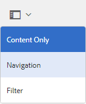

# AEM Assets品牌门户的新增功能 {#what-s-new-in-aem-assets-brand-portal}

Adobe Experience Manager(AEM) Assets Brand Portal可帮助您跨设备轻松获取、控制和安全地将已批准的创意资产分发给外部的合作伙伴和内部业务用户。它有助于提高资产共享的效率，加快资产的上市时间，并降低不合规和未授权访问的风险。Adobe正在努力改善整体Brand Portal体验。抢先领略新增功能和增强功能。

## 6.4.4中更改的内容 {#what-is-changing-in}

Brand Portal6.4.4版本侧重于增强文本搜索和主要客户请求。请参阅最新 [的Brand Portal发行说明](brand-portal-release-notes.md)。

### 搜索增强功能 {#search-enhancements}

Brand Portal6.4.4从在筛选窗格中对属性谓词的部分文本搜索支持。要允许部分文本搜索，您需要在搜索表单中启用“属性谓词”中的 **“部分搜索** ”。

阅读进一步了解部分文本搜索和通配符搜索。

#### 部分短语搜索 {#partial-phrase-search}

您现在可以通过在筛选窗格中只指定一部分(即一个单词或两个词)来搜索资产。

**用例**&#x200B;当您不确定搜索短语中出现的单词的精确组合时，部分短语搜索很有用。

例如，如果您在Brand Portal中的搜索表单使用属性谓词对资产标题进行部分搜索，则指定 **期限夏令营** 将在其标题短语中使用单词Camp返回所有资产。

#### 通配符搜索 {#wildcard-search}

Brand Portal允许使用搜索查询中的星号(*)以及搜索短语中单词的一部分。

**用例如果**&#x200B;您不确定搜索短语中出现的确切单词，可以使用通配符搜索来填补搜索查询中的间隙。

例如，如果在Brand Portal中搜索表单使用属性谓词对资产标题进行部分搜索，则指定 **爬入*** 会返回以字符 **开头的所有资产(如果在Brand** Portal中搜索表单)。

同样，指定：

* ***爬出** 会返回以字符结尾的所有资产 **(** 以字符结尾)。

* *** launch*** 返回包含字符单词在其标题短语 **中上升** 的所有资产。

>[!NOTE]
>
>选择 **“部分搜索** ”复选框时， **默认情况下会选中“忽略大小写** ”。

## 6.4.3中更改的内容 {#what-changed-in}

Brand Portal6.4.3版侧重于-为组织提供替代别名以及在Brand Portal访问URL中的租户ID、新文件夹层次结构配置、视频支持增强、从AEM作者实例发布到Brand Portal的计划、操作增强-和客户请求。

### 针对非管理员的文件夹层次结构导航

管理员现在可以配置登录时将文件夹显示给非管理员用户(编辑器、查看器和客人用户)的方式。[“启用文件夹层次结构](../using/brand-portal-general-configuration.md) ”配置添加到管理工具面板中的 **常规设置**&#x200B;中。如果配置为：

* **启用**&#x200B;后，非管理员用户可见从根文件夹开始的文件夹树。因此，授予他们类似于管理员的导航体验。
* **disabled**，only the shared folders be displayed on the landing page.

**使用案例**

[启用文件夹层次结构](../using/brand-portal-general-configuration.md) 功能(启用后)可帮助您将文件夹与从不同层次结构共享的相同名称区分开来。登录后，非管理员用户现在可以看到共享文件夹的虚拟父文件夹(和祖代)文件夹。

共享文件夹按虚拟文件夹中的各个目录进行组织。您可以使用锁定图标识别这些虚拟文件夹。

请注意，虚拟文件夹的默认缩略图是第一个共享文件夹的缩略图图象。

### 在特定文件夹层次结构或路径中搜索

**在搜索表单中引入了路径浏览器** 谓词，以允许搜索特定目录中的资产。路径浏览器的搜索谓词的默认搜索路径为 */content/dam/mac/&lt; tenant-id&gt;/*，可通过编辑默认搜索表单来进行配置。

* 管理员用户可以使用路径浏览器导航到Brand Portal上的任何文件夹目录。
* 非管理员用户可以使用路径浏览器仅导航到与其共享的文件夹(并导航回父文件夹)。
例如， */content/dam/mac/&lt; tenant-id&gt;/folderA/folderC* 与非管理员用户共享。用户可以使用路径浏览器在FolderC中搜索资产。此用户还可以导航到folderB和folderA(因为它们是与用户共享的FolderC的上级)。

**使用案例**

您现在可以限制您浏览到的特定文件夹中的资产搜索，而不是从根文件夹开始。

请注意，在这些文件夹下搜索只会返回与用户共享的资产的结果。

### Dynamic Media视频演绎版支持

除原始视频文件之外，AEM作者实例处于动态媒体混合模式的用户还可以预览和下载动态媒体演绎版。

要允许在特定租户帐户上预览和下载动态媒体演绎版，管理员需要在管理员工具面板中指定 **Dynamic Media配置** (视频服务URL(DM-Gateway URL)和注册ID)以在 **视频** 配置中提取动态视频)。

**可以在以下位置预览** Dynamic Media视频：

* 资产详细信息页面
* 资产卡片视图
* 链接共享预览页面

Dynamic Media视频编码可从以下位置下载：

* 品牌门户
* 共享链接

### 计划发布到Brand Portal

从 [AEM(6.4.2.0)发布工作流到Brand Portal的资产(和文件夹)](https://helpx.adobe.com/experience-manager/6-4/release-notes/sp-release-notes.html#main-pars_header_9658011) 发布工作流可以安排在以后的日期和时间。

同样，通过计划从Brand Portal工作流取消发布，可以在以后的日期(时间)从门户网站删除已发布的资产。

### URL中的可配置租户别名

组织可以通过在URL中具有替代前缀，使其门户URL自定义。要在其现有门户URL中获取租户名称别名，组织需要联系Adobe支持。

请注意，只能自定义Brand Portal URL的前缀，而不能是整个URL。\
例如，具有现有域 **geomettrix.brand-portal.adobe.com** 的组织可以获取 **根据请求创建的geomettrixinc.brand-portal.adobe.com** 。

但是，AEM作者实例只能通过租户id URL [进行配置](https://helpx.adobe.com/experience-manager/6-5/assets/using/brand-portal-configuring-integration.html) ，而不能使用租户别名(替代) URL进行配置。

**使用案例**&#x200B;组织可以通过自定义门户URL来满足他们的品牌需求，而不是坚持使用Adobe提供的URL。

### 下载体验增强功能

该发行版提供简化的下载体验，数量减少了单击次数和警告数量：

* 选择仅下载演绎版(而非原始资产)。
* 当对原始再现进行访问时下载资源。

## 6.4.2中更改的内容 {#what-changed-in-1}

Brand Portal6.4.2发行版引入了一系列功能，可满足组织的资产分发需求，并帮助他们触及全球范围内通过客人访问和优化体验获得的大量用户。Brand Portal还通过新增加的管理员配置为组织提供更好的控制，并使客户能够请求客户请求。

### 客人访问

AEM品牌门户允许客人访问门户。客人用户不需要凭据进入门户，并可以访问和下载所有公共文件夹和集合。客人用户可以将资产添加到其Lightbox(私有集合)并下载相同的资源。他们还可以查看由管理员设置的智能标记搜索和搜索谓词。客人会话不允许用户创建集合和保存的搜索或进一步共享、访问文件夹和集合设置以及共享资源作为链接。

在组织中，允许多个并发客人会话，该会话仅限于每个组织的用户配额的10%。

客人会话在两小时内保持活动状态。因此，Lightbox的状态也会被保留，直到从会话开始时间开始两个小时。两小时后，客人会话必须重新启动，因此灯箱状态丢失。

### 加速下载

Brand Portal用户可以利用基于IBM AssesPera Connect的快速下载速度加快速度高达25倍的速度并享受无缝下载体验，无论他们在全球的哪个位置。要从Brand Portal或共享链接更快地下载资源，用户需要在下载对话框中选择 **“启用下载加速** ”选项，并在其组织中启用下载加速。

要为组织启用基于IBM的加速下载，管理员可以 **从管理工具面板中的**[“常规设置](brand-portal-general-configuration.md#allow-download-acceleration) ”中启用“下载加速”选项(默认情况下禁用)。要更详细地了解从Brand Portal和共享链接下载资源文件的先决条件和疑难解答步骤，请参阅 [引导从Brand Portal下载的指南](../using/accelerated-download.md#main-pars-header)。

### 用户登录报告

已引入用于跟踪用户登录情况的新报告。**用户登录** 报告有助于组织审核和检查委托管理员和Brand Portal的其他用户。

在生成报告生成期间，该报告将每个用户的显示姓名、电子邮件ID、角色(管理员、查看器、用户名、用户名、用户)、组、上次登录名、活动状态和登录计数记录在“品牌门户6.4.2”部署中。管理员可以将报告导出为. csv。用户登录报告还使组织能够更密切地监视用户与已批准品牌资源的交互情况，从而确保符合公司合规办公室的要求。

### 访问原始再现

管理员可以限制用户访问原始图像文件(.jpeg、. tiff、. png、. bmp、. gif、pjpeg、x-able-any-map、x-portable-bitmap、x-deskable-graymap、x-domportable-fillmap、x-digital-publish、x-digital-photoshop、x-create、image/photoshop、image/x-icon、image/photoshop photoshop、. psd、image/vnd. adobe. photoshop)，允许访问他们从Brand Portal或共享链接下载的低分辨率再现。此访问可以在管理员工具面板中的用户角色页面的用户组选项卡中控制用户组级别。

* 默认情况下，所有用户都可以下载原始再现，因为对所有用户都启用了“访问原件”。
* 管理员需要取消选择相应的复选框以阻止一组用户访问原始再现。
* 如果某个用户是多个用户组的成员，但只有其中一个用户组有限制，则限制适用于该用户。
* 这些限制不适用于管理员，即使他们是受限用户组的成员也是如此。
* 用户共享资产作为链接的权限适用于使用共享链接下载资产的用户。

### 卡片视图和列表视图上的文件夹层次结构路径

文件夹的卡片，在卡片视图中，现在将文件夹层次结构信息显示给非管理员用户(编辑器、查看器和客人用户)。此功能可让用户了解文件夹相对于父级层次结构的位置。

文件夹层次结构信息在区分文件夹的名称与从其他文件夹层次结构共享的其他文件夹时特别有用。如果非管理员用户不知道与其共享的资产的文件夹结构，则具有类似名称的资产/folders似乎难以理解。

* 将截断各个卡上显示的路径以适合卡大小。但是，用户可以在截断路径上方将整个路径视为工具提示。

列表视图向Brand Portal的所有用户显示列中资产的文件夹路径。

### 查看资产属性的概述选项

Brand Portal为非管理员用户(编辑器、查看器、客人用户)提供概述选项，以查看选定资产/文件夹的资产属性。概述选项可见：

1. 选择资产/文件夹时顶部的工具栏中。
2. 在选择边栏选择器时，请进入下拉菜单。

在选择资产/文件夹时选择“概述”选项，用户可以查看资产创建的标题、路径和时间。但是，在资产详细信息页面上选择概述选项后，用户可以看到资产的元数据。

## 新配置

管理员添加了六个新配置，使管理员能够对特定租户启用/禁用以下功能：

* 允许来宾访问
* 允许用户请求访问Brand Portal
* 允许管理员从Brand Portal中删除资产
* 允许创建公共集合
* 允许创建公共智能收藏集
* 允许下载加速

上述配置位于管理工具面板的“访问”和“常规”设置下。

### Adobe. io主机UI可配置OAuth集成

Brand Portal6.4.2从使用Adobe. io [https://legacy-oauth.cloud.adobe.io/](https://legacy-oauth.cloud.adobe.io/) 界面创建JWT应用程序，这支持配置OAuth集成以允许AEM Assets与Brand Portal集成。以前，用于配置OAuth集成的UI在 [https://marketing.adobe.com/developer/中托管](https://marketing.adobe.com/developer/)。要了解有关将AEM资产与Brand Portal集成以便将资产和集合发布到Brand Portal的更多信息，请参阅 [配置AEM Assets与Brand Portal集成](https://helpx.adobe.com/in/experience-manager/6-4/assets/using/brand-portal-configuring-integration.html)。

## 搜索增强功能

管理员可以使用更新的属性谓词来确定非区分大小写的属性，该谓词有对忽略案例的检查。此选项可用于属性谓词和多值属性谓词。\
但是，非区分大小写搜索比默认搜索属性谓词慢。如果搜索过滤器中存在太多非区分大小写的谓词，搜索可能会减慢。因此，建议建议谨慎使用非区分大小写的搜索。

## 6.4.1中更改的内容 {#what-changed-in-2}

Brand Portal6.4.1是一个平台升级版本，它引入了一些新增功能和重要增强功能，如浏览、搜索和性能增强，以提供满足客户体验的增强。

### 浏览增强功能

* 新的内容树边栏可快速导航资产层次结构。

* 引入了新的键盘快捷键，例如 _(p)_ 用于导航到属性页面， _(e)_ 用于编辑，以及 _(ctrl+ c)_ 用于复制操作。
* 改进了滚动、延迟加载体验以及浏览大量资产的列表视图。
* 增强的卡片视图，支持基于视图设置的不同大小卡。

* 卡片视图现在显示鼠标悬停在日期标签上方时的日期/时间戳。

* “增强列”视图( **包含资产快照** 下的更多详细信息)，可导航到资产的详细信息页面。

* 除了区域设置、资产类型、维度、大小、评级和发布信息之外，列表视图现在还会显示第一列中资产的文件名。新 **的视图设置** 可用于配置在列表视图中显示的详细信息量。

* 改进了资产详细信息体验，能够使用新的导航按钮在资产之间来回导航，并查看资产计数。

* 用于预览从AEM上传的音频文件的新功能，该文件位于资产的详细信息页面中。
* 资产属性中提供的新相关资产功能。与AEM上的其他源/派生资源相关的资产(在Brand Portal上)现在Brand Portal中保持其关系不变，并且链接到属性页面上的相关资产。
* 引入了用于限制非管理员用户创建公共集合的新配置。组织可以与Adobe支持团队一起为特定帐户配置此功能。

### 搜索增强功能

* 引入的功能在导航到搜索项后返回到搜索结果中的同一位置，而无需再次运行搜索查询。
* 新的搜索结果计数可显示已提供搜索结果的数量。
* 改进了文件类型搜索筛选器，能够根据较低粒度的MIME类型(如.jpg、. png和. psd)筛选搜索结果，这些类型与以前的图像、文档、多媒体选项相比。
* 增强的集合搜索过滤器，具有准确的时间戳而不是以前的时间滑块功能。
* 引入了新访问类型过滤器以搜索公共或非公开集合。

### 下载优化

* 直接下载一个大型文件，而无需创建zip文件，从而提高速度和吞吐量。
* 链接共享的Zip下载限制已增加至GB，从GB增加。

* 在从Brand Portal下载资源或通过共享链接功能下载资源时，用户现在可以选择仅下载自定义和原始文件，以及防止开箱即用再现。

### 性能增强

* 资源下载速度提高了100%。
* 对资产搜索响应的改进高达40%。
* 浏览性能提高40%。

**注意**：引用的改进与在实验室进行的测试一样。

### 增强的报告功能

**引入了链接共享报告**&#x200B;一个新报告，用于提供有关共享链接的信息。链接共享报告会列出所有URL，并在指定的时间范围内与组织内部的内部和外部用户共享。它还会在共享链接、由谁共享以及何时过期时通知。

**修改进入点以访问使用情况报告**&#x200B;使用情况报告现在已与其他报告合并，现在可以从资产报表控制台中查看。要访问资产报表控制台，请导航到管理工具面板 **中的创建/管理报表** 。

**在Brand Portal上利用报告**&#x200B;报告界面改进用户体验变得更直观，并加强对组织的控制。除了创建各种报告，管理员现在还可以重新访问生成的报表，并下载或删除这些报告，因为这些报告保存在Brand Portal中。

可以通过添加或删除默认列自定义创建的每个报告。此外，可以将自定义列添加到下载、过期和发布报告以控制其粒度程度。

### 改进的管理工具

改进了元数据、搜索和报告的Admin工具中的属性选取器，具有前置和浏览功能，可简化管理体验。

### 其他增强功能

* 现在，可以通过标记AEM Assets品牌门户复制对话框中的Public Folder Publish复选框，向Brand Portal的一般用户公开发布从AEM6.3.2.1和6.4发布到Brand Portal的资产。

* 如果有人请求访问Brand Portal，则通过访问请求电子邮件，管理员将收到与Brand Portal通知区域中的通知不同的通知。

## 6.3.2中更改的内容 {#what-changed-in-3}

Brand Portal6.3.2包含面向主要客户请求和一般性能增强的新功能和增强功能。

### 请求访问Brand Portal {#request-access-to-brand-portal}

用户现在可以使用全新****需要访问Brand Portal访问Brand Portal登录屏幕上提供的访问功能。

根据用户是否具有Adobe ID或需要创建Adobe ID，用户可以按照相应的工作流程提交请求。Brand Portal产品管理员在通知区域接收此类请求，并通过Adobe Admin Console授予访问权限。

有关详细信息，请参阅 [请求访问Brand Portal](../using/brand-portal.md#requestaccesstobrandportal)。

### 下载的资产中的增强功能 {#enhancement-in-the-assets-downloaded-report}

下载的资产现在包括指定日期和时间范围内每个用户的资产下载计数。用户可以下载. csv格式的此报告并编译数据，如许可资产的下载总数。

有关详细信息，请参阅 [创建和管理其他报告中的步骤和6](../using/brand-portal-reports.md#createandmanageadditionalreports)。

### Brand Portal维护通知 {#brand-portal-maintenance-notification}

Brand Portal现在在即将到来的维护活动前几天显示通知横幅。示例通知：

有关详细信息，请参阅 [Brand Portal维护通知](https://helpx.adobe.com/experience-manager/brand-portal/using/brand-portal.html#BrandPortalmaintenancenotification)。

### 增强了使用链接共享功能共享的许可资产 {#enhancement-for-licensed-assets-shared-using-the-link-share-feature}

在使用链接共享功能下载许可的资产时，系统会提示您同意针对这些资产的许可协议。

有关详细信息，请参阅共享资产中 [的第12步作为链接](../using/brand-portal-link-share.md#shareassetsasalink)。

### 用户选取器增强 {#user-picker-enhancement}

用户选取器性能现已得到增强，可满足拥有大量用户群的客户的需求。

### Experience Cloud品牌变更 {#experience-cloud-branding-changes}

Brand Portal现在符合全新的Adobe Experience Cloud品牌。

## 6.3.1中更改的内容 {#what-changed-in-4}

Brand Portal6.3.1包含面向AEM与AEM对齐的新功能和增强功能。

### 升级的用户界面 {#upgraded-user-interface}

要使Brand Portal用户体验与AEM保持一致，Adobe正在过渡到Coral用户界面。此更改增强了整体可用性，包括导航和外观。

#### 增强的导航体验 {#enhanced-navigational-experience}

* 通过新的Adobe徽标快速访问管理工具：

* 通过叠加进行产品导航：

* 对父文件夹的快速导航：

* 对所需内容和工具的快速搜索和导航：

### 增强的浏览体验 {#enhanced-browsing-experience}

* 用于浏览嵌套文件夹的新列视图：

 

* 在文件夹中的资产列表中，上传的最新资产显示在顶部。

### 增强的搜索体验 {#enhanced-search-experience}

* 新的Omni搜索功能可方便您在键入搜索关键字时通过自动建议快速访问相关内容、功能或标记。Omni搜索可在所有搜索功能中使用。

* 您还可以将搜索过滤器添加到Omni搜索以进一步缩小并加快搜索速度。

* 新的基于资产评级的搜索允许您搜索带有评级的资产(如果从AEM资产发布)。
* 新的多值搜索功能使用AND运算符接受多个关键字，从而更快地发现资源。
* 新的搜索提升功能可让您提高搜索相关性，以便特定资产显示在搜索结果的顶部。
* 新的基于路径的搜索功能允许您提供嵌套文件夹的路径，以便在该文件夹中搜索资产。

#### 新的基于标签的智能搜索 {#new-smart-tags-based-search}

如果具有智能标签的图像从AEM资产发布到Brand Portal，则可以使用智能标签名称作为搜索关键字在Brand Portal中搜索这些图像。此功能仅适用于文件。

### 增强的下载体验 {#enhanced-downloading-experience}

下载嵌套文件夹后，您可以保留原始文件夹层次结构。嵌套文件夹中的资产可在单个文件夹中下载，而非单独文件夹。

### 改进的性能 {#improved-performance}

浏览、搜索和下载功能中的增强功能显著提高了Brand Portal性能。

### 新的资产数字权限管理 {#new-digital-rights-management-for-assets}

管理员可以在共享资产之前设置资产的过期日期和时间。资产到期后，查看器和编辑器会显示，但不可下载。资产过期时，管理员会收到通知。

### 增强的资源排序 {#enhanced-asset-sorting}

列表视图中文件夹中的资产排序不再局限于在第一页上显示的资产数。将对文件夹中的所有资产进行排序，而不管第一个页面中是否列出了所有资源。

### 增强的报告功能 {#reporting-capabilities}

管理员可以创建和管理三种类型的报告—下载、过期和已发布资产。还可以在报告中配置列，并将报表导出为CSV格式。

### 其他元数据 {#additional-metadata}

Brand Portal6.3.1引入了额外的元数据，该元数据与AEM Assets6.3相同。您可以使用架构编辑器表单控制应在资产属性页面上可见的元数据。资产元数据对外部链接共享用户不可见，用户只能使用链接共享URL预览和下载资产。

### 适用于管理员的其他功能 {#additional-capabilities-for-administrators}

* 在将自定义设置完成到登录屏幕墙纸之前，管理员可以预览更改。

* 管理员添加新用户后，他们不需要接受要添加到Brand Portal的邀请，而会自动添加这些邀请。

### AEM Assets6.3中的新发布功能 {#new-publishing-capabilities-in-aem-assets}

* AEM管理员可以使用AEM6.3SP1-CFP1(6.3.1.1)将元数据架构从AEM资产发布到Brand Portal，该版本将在2017年第四季度发布。

* AEM管理员可以使用AEM6.2SP1-CFP和AEM6.3 SP1-CFP(6.3.1.1)将所有标记从AEM资产发布到Brand Portal。

* 在AEM资产中，您可以发布具有标记(包括智能标签)的资产和集合。然后，您可以在Brand Portal中使用这些标记搜索这些资产或集合，作为搜索关键字。

## Frequently asked questions {#frequently-asked-questions}

**测验。我是否将无法访问我创建的任何现有资产、功能或配置？****ans。** 您的所有现有功能和配置都将保持不变。最终用户不受影响，内容将保持不变。

**ques。我何时可以转到Brand Portal的新版本？****ans。** Brand Portal6.4.4于2019年月发布到生产产品。下一个Brand Portal版本预期在2017年第三季度发布。

>[!NOTE]
>
>发布计划为tench，可能会更改。要获得更新的发行计划，请与您的Adobe客户经理或客户支持联系。

**ques。我的用户会受到影响吗？****ans。** 此更改仅限于Brand Portal，因此不会影响您的最终用户。

**ques。我是否需要任何操作？****ans。** 管理员无需执行任何操作。访问新的Brand Portal后，请参阅文档以了解所有bells和whists。

**ques。我应该与谁联系？****ans。** 联系您的Adobe客户经理或客户支持。
