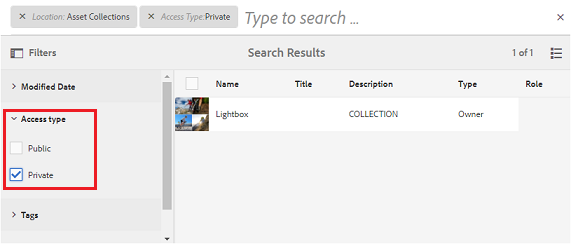

# Experience Manager Assets Brand Portal的新增功能 {#what-s-new-in-aem-assets-brand-portal}

Adobe Experience Manager Assets Brand Portal可帮助您轻松地获取、控制经批准的创意资产，并将这些资产安全地分发给跨设备的外部参与方和内部业务用户。 它有助于提高资产共享效率，加快资产上市速度，并降低不合规和未经授权访问的风险。 Adobe正在努力改善整个Brand Portal体验。 以下是对新增功能和增强功能的简要介绍。

## 2024.02.0版中的更改内容 {#what-changed-in-February-2024}

Brand Portal 2024.02.0是一个内部版本，其中包括对关键问题的修复。 查看最新的[Brand Portal发行说明](brand-portal-release-notes.md)。

## 2023.10.0版中的更改内容 {#what-changed-in-October-2023}

Brand Portal 2023.10.0是一个内部版本，其中包括对关键问题的修复。 查看最新的[Brand Portal发行说明](brand-portal-release-notes.md)。

## 2023.08.0版中的更改内容 {#what-changed-in-August-2023}

Brand Portal 2023.08.0是一个内部版本，其中包括对关键问题的修复。 查看最新的[Brand Portal发行说明](brand-portal-release-notes.md)。

## 2023.05.0版中的更改内容 {#what-changed-in-May-2023}

Brand Portal 2023.05.0是一个内部版本，其中包括对关键问题的修复。 查看最新的[Brand Portal发行说明](brand-portal-release-notes.md)。

## 2023.02.0版中的更改内容 {#what-changed-in-February-2023}

Brand Portal 2023.02.0是一个内部版本，其中包括对关键问题的修复。 查看最新的[Brand Portal发行说明](brand-portal-release-notes.md)。

## 2022.10.0版中的更改内容 {#what-changed-in-October-2022}

Brand Portal 2022.10.0是一个内部版本，其中包括对关键问题的修复。 查看最新的[Brand Portal发行说明](brand-portal-release-notes.md)。

## 2022.08.0版中的更改内容 {#what-changed-in-August-2022}

Brand Portal 2022.08.0是一个内部版本，其中包括对关键问题的修复。 查看最新的[Brand Portal发行说明](brand-portal-release-notes.md)。

## 2022.05.0版中的更改内容 {#what-changed-in-May-2022}

Brand Portal现在每十二小时执行一次自动作业，以删除发布到AEM的所有Brand Portal资源。 因此，您无需手动删除“贡献”文件夹中的资产，即可将文件夹大小保持在阈值限制以下。 您还可以使用Brand Portal中的&#x200B;**[!UICONTROL 工具]** > **[!UICONTROL 资源贡献状态]** > **[!UICONTROL 删除报告]**&#x200B;选项来监视自动执行的删除作业的状态。 作业的报表提供以下详细信息：

* 作业开始时间
* 作业结束时间
* 作业状态
* 作业中包含的资产总数
* 已成功删除作业中的资源总数
* 作为作业运行结果而提供的总存储空间

您还可以进一步深入查看删除作业中包含的每个资源的详细信息。 资产标题、大小、作者、删除状态和删除时间等详细信息将包含在报表中。

详细的

此外，Brand Portal 2022.05.0还包含对关键问题的修复。 查看最新的[Brand Portal发行说明](brand-portal-release-notes.md)。

## 2022.02.0版中的更改内容 {#what-changed-in-Feb-2022}

Brand Portal 2022.02.0是一个内部版本，其中包括对关键问题的修复。 查看最新的[Brand Portal发行说明](brand-portal-release-notes.md)。

## 2021.10.0版中的更改内容 {#what-changed-in-october-2021}

Brand Portal 2021.10.0是一个内部版本，其中包括对关键问题的修复。 查看最新的[Brand Portal发行说明](brand-portal-release-notes.md)。

## 2021.08.0版中的更改内容 {#what-changed-in-august-2021}

Brand Portal 2021.08.0是一个内部版本，为企业和团队客户引入了业务配置文件，使组织能够更好地控制其资源。 现在，用户在新组织和迁移的组织上拥有特定于组织的权利。 在迁移期间，所有现有的Adobe ID帐户都会迁移到Business ID。

* Business ID迁移至所有新的和现有的组织中。
* Business ID不需要任何特定设置，例如声明域或设置SSO。
* 您可以添加具有任何电子邮件地址的用户，包括公共电子邮件域，如gmail.com或outlook.com。

**对Brand Portal用户的影响**

迁移不会影响您的现有数据集、资产、用户或任何设置。 迁移期间发生的唯一内部更改是现有组织有权访问企业配置文件。

>[!NOTE]
>
>企业配置文件当前适用于2021年8月16日之后创建的新组织。
>
>在迁移组织之前，您可以继续使用Adobe ID、Enterprise ID或Federated ID类型来访问组织。

### 参考文章 {#reference-articles}

* [正在引入Adobe配置文件](https://helpx.adobe.com/enterprise/kb/introducing-adobe-profiles.html)

* [管理Adobe配置文件](https://helpx.adobe.com/enterprise/using/manage-adobe-profiles.html)

* [更新用户和管理员的登录体验](https://helpx.adobe.com/enterprise/using/storage-for-business.html#new-admin-sign-in-exp)

* 迁移期间[登录限制](https://helpx.adobe.com/enterprise/kb/account-temporarily-unavailable.html)

* [管理Admin Console中的用户](https://helpx.adobe.com/enterprise/using/manage-users-individually.html)

* [管理企业用户的产品配置文件](https://helpx.adobe.com/enterprise/using/manage-product-profiles.html#assign-users)

* [域信任](https://helpx.adobe.com/enterprise/admin-guide.html/enterprise/using/set-up-identity.ug.html#directory-trusting)

<!--   
### Add new users to T2E organization   {#add-users-to-T2E-org}

On adding a new user in Admin Console for a new or migrated T2E organization, the user will have to perform an additional step **Join Team** to get entitled to the T2E organization. 

The user is entitled only if the user chooses to **Join Team**, otherwise the user won't get access to the selected T2E organization in Brand Portal. 

>[!NOTE]
>
>The workflow is not applicable to the existing Brand Portal users.

### Additional screen while navigating to Admin Console   {#navigate-to-admin-console}

The administrators will have to perform an additional step of selecting the T2E organization while navigating from Brand Portal to Admin Console. The workflow applies on the new and migrated T2E organizations.   

Selection of the T2E organization is a one-time activity and is not required everytime the administrator navigates from Brand Portal to Admin Console.

1. Log in to a T2E organization in Brand Portal as administrator.
1. Go to **[!UICONTROL Tools]** > **[!UICONTROL Users]** > **[!UICONTROL Management]** and click on the link **[!UICONTROL Launch Admin Console]**. 

   Or, go to **[!UICONTROL Unified Shell]** > **[!UICONTROL Administration]** and click on the link **[!UICONTROL Launch Admin Console]**. 
1. Search the T2E organization to login to Admin Console.

   

### Restriction during migration of an organization   {#login-restriction}

When an organization is undergoing T2E migration, the users of that organization will not be able to login to Brand Portal. The following error message appears on the screen. However, the migration won't impact the active user session until the token expires. 

Once the migration is complete, the users can login to Brand Portal. The users will receive an email notification containing the entitlement changes. If the users are entitled to more than one organization, they will have to select the organization at the time of login. 
-->

<!--
For a new or migrated T2E orgnization, the users will have an organization specific entitlement. A user can have multiple entitlements with the same email id for different T2E organizations. 
-->

## 2021.06.0版中的更改内容 {#what-changed-in-june-2021}

Brand Portal 2021.06.0是一个内部版本，其中包括对关键问题的修复。 查看最新的[Brand Portal发行说明](brand-portal-release-notes.md)。

## 2021.02.0版中的更改内容 {#what-changed-in-feb-2021}

Brand Portal 2021.02.0是一个增强版本，它在AEM Assetsas a Cloud Service引入了Brand Portal激活工作流，促进了AEM Assetsas a Cloud Service的资产源功能，改进了资产下载体验，并包括关键修复。 它还允许管理员配置文件夹、收藏集的默认下载行为，以及租户级别的资产批量下载。 Brand Portal **[!UICONTROL 使用情况报表]**&#x200B;也已修改，以反映活动的Brand Portal用户。

### 在AEM Assetsas a Cloud Service上激活Brand Portal {#bp-automation-on-cloud-service}

AEM Assets as a Cloud Service现在有权预配置一个Brand Portal实例。 Cloud Manager用户可以在AEM Assetsas a Cloud Service实例上激活Brand Portal。

之前，AEM Assetsas a Cloud Service是使用Adobe Developer Console手动配置Brand Portal的。

Cloud Manager用户触发激活工作流，该工作流在后端创建所需的配置，并在与AEM Assetsas a Cloud Service实例相同的IMS组织上激活Brand Portal。

要在您的AEM Assetsas a Cloud Service实例上激活Brand Portal，请执行以下操作：

1. 登录AdobeCloud Manager并导航到&#x200B;**[!UICONTROL 环境]**。
1. 从列表中选择环境（逐个）。 找到与Brand Portal关联的环境后，单击&#x200B;**[!UICONTROL 激活Brand Portal]**&#x200B;按钮以开始激活工作流。
1. 激活Brand Portal租户后，状态将更改为“已激活”。

请参阅[在AEM Assetsas a Cloud Service上激活Brand Portal](https://experienceleague.adobe.com/docs/experience-manager-cloud-service/assets/brand-portal/configure-aem-assets-with-brand-portal.html)。

### AEM Assets上的Asset Sourcingas a Cloud Service {#asset-sourcing-on-cloud-service}

AEM Assetsas a Cloud Service上现在提供了资源源功能。 默认情况下，所有Cloud Service用户都启用该功能。 允许的Brand Portal用户可以通过将新资源上传到贡献文件夹并将贡献文件夹从Brand Portal发布到AEM Assetsas a Cloud Service实例来贡献资源源。 管理员可以审核和批准Brand Portal用户的贡献，以进一步将它们分发给其他Brand Portal用户。

以前，资产源仅在AEM Assets上可用（内部部署和托管服务）。

请参阅Brand Portal](https://experienceleague.adobe.com/docs/experience-manager-brand-portal/using/asset-sourcing-in-brand-portal/brand-portal-asset-sourcing.html?lang=zh-Hans)中的[资源源。

### 资源下载 {#asset-download-setting}

除了现有的&#x200B;**[!UICONTROL 下载设置]**&#x200B;之外，Brand Portal管理员现在还可以配置&#x200B;**[!UICONTROL 资源下载]**&#x200B;设置。 此设置允许管理员在租户级别管理文件夹、收藏集的默认下载行为和资产（超过20个资产）的批量下载。

<!--
Earlier, all the asset renditions were directly downloaded in a zip folder in case of folder, collection, and bulk download of assets. As the **[!UICONTROL Download]** dialog is skipped for folders or collections, there was no mechanism to control the downloading behaviour of the assets. Due to this, the users were finding it difficut to search for a particular asset rendition from a folder containing huge bunch of downloaded renditions. 
-->

以前，所有资源演绎版都直接下载到zip文件夹中。 已跳过文件夹和收藏集的&#x200B;**[!UICONTROL 下载]**&#x200B;对话框，并且没有控制资源下载行为的方法，因此很难通过多次下载搜索特定演绎版。

**[!UICONTROL 资源下载]**&#x200B;设置现在提供了一个选项，用于在下载文件夹、收藏集或批量下载资源时，为每个资源创建一个单独的文件夹。

如果&#x200B;**[!UICONTROL 资源下载]**&#x200B;设置被禁用，则文件夹或收藏集将下载到包含同一文件夹下所有资源演绎版的zip文件夹中，但使用共享链接下载资源的情况除外。

以管理员身份登录到您的Brand Portal租户，并导航到&#x200B;**[!UICONTROL 工具]** > **[!UICONTROL 下载]**。 管理员可以启用&#x200B;**[!UICONTROL 资源下载]**&#x200B;设置，以便在下载文件夹、收藏集和批量下载资源时为每个资源创建单独的文件夹。

请参阅[从Brand Portal下载资源](https://experienceleague.adobe.com/docs/experience-manager-brand-portal/using/download/brand-portal-download-assets.html)。
<!--
### Download using Share link {#download-using-share-link}

The default behavior of downloading the assets using share link is now independent of the **[!UICONTROL Download Settings]**. A separate folder is created for each asset while downloading the assets using share link. 
-->

### 使用情况报表 {#usage-report}

已修改Brand Portal **[!UICONTROL 使用情况报表]**，以仅反映活动的Brand Portal用户。 未分配给Admin Console中任何产品配置文件的Brand Portal用户被视为非活动用户，未反映在&#x200B;**[!UICONTROL 使用情况报表]**&#x200B;中。

以前，活动用户和非活动用户都显示在使用情况报表中。

## 2020.10.0版中的更改内容 {#what-changed-in-oct-2020}

Brand Portal 2020.10.0是一个增强版本，其重点在于简化资源下载体验并包括关键修复。 增强功能包括新增和改进的资源下载工作流、用于排除演绎版的其他选项、从&#x200B;**[!UICONTROL 演绎版]**&#x200B;面板直接下载、用于允许特定用户组的访问和下载权限的配置，以及从所有Brand Portal页面轻松导航到文件、收藏集和共享链接。 查看最新的[Brand Portal发行说明](brand-portal-release-notes.md)。

### 简化的下载体验 {#download-dialog}

以前，**[!UICONTROL 下载]**&#x200B;对话框出现时带有多个选项，例如为每个资源创建单独的文件夹、发送电子邮件资源、选择原始资源、自定义呈现形式、动态呈现形式、排除系统呈现形式，以及启用下载加速，这些选项对于非技术用户或新用户而言并不明确，尤其是在选择了多个资源或文件夹进行下载时。 此外，用户无法看到所有资源演绎版，也无法排除特定的自定义或动态演绎版。

新的&#x200B;**[!UICONTROL 下载]**&#x200B;对话框简化了资源选择和过滤流程，使Brand Portal用户在下载资源演绎版时能够更轻松地做出有效的决策。 根据[**[!UICONTROL 下载]**](brand-portal-download-assets.md)配置和&#x200B;**[!UICONTROL 下载]**&#x200B;设置，它列出了所有选定的资源及其演绎版。

>[!NOTE]
>
>默认情况下，所有用户现在都启用了&#x200B;**[!UICONTROL 快速下载]**，在从Brand Portal下载资源之前，需要在其浏览器的扩展中安装IBM Aspera Connect 3.9.9 (`https://www.ibm.com/docs/en/aspera-connect/3.9.9`)。

<!--
If any of the **[!UICONTROL Custom Rendition]** or **[!UICONTROL System Rendition]** is enabled in the [**[!UICONTROL Download]**](brand-portal-download-assets.md) configuration and **[!UICONTROL Download]** settings are enabled for the group users, the new **[!UICONTROL Download]** dialog appears with all the renditions of the selected assets or folders containing assets in a list view. 
-->

通过&#x200B;**[!UICONTROL 下载]**&#x200B;对话框，用户可以：

* 查看下载列表中任何资源的所有可用演绎版。
* 排除不需要下载的资产演绎版。
* 只需单击一次，即可将同一组演绎版应用于所有类似的资源类型。
* 为不同的资源类型应用不同的演绎版集。
* 为每个资源创建单独的文件夹。
* 下载所选资源及其演绎版。

对于独立资产、多个资产、包含资产的文件夹、已许可或未许可资产以及使用共享链接下载资产，下载工作流保持不变。 查看从Brand Portal](https://experienceleague.adobe.com/docs/experience-manager-brand-portal/using/download/brand-portal-download-assets.html)下载资源的[步骤。

### 快速导航  {#quick-navigation}

以前，查看&#x200B;**[!UICONTROL 文件]**、**[!UICONTROL 收藏集]**&#x200B;和&#x200B;**[!UICONTROL 共享链接]**&#x200B;的选项已隐藏，用户每次要切换到另一个视图时都需要多次单击。

在Brand Portal 2020.10.0中，用户可以使用快速导航链接通过一次单击从所有Brand Portal页面导航到&#x200B;**[!UICONTROL 文件]**、**[!UICONTROL 收藏集]**&#x200B;和&#x200B;**[!UICONTROL 共享链接]**。

### 增强型演绎版面板 {#rendition-panel}

以前，如果在&#x200B;**[!UICONTROL 下载]**&#x200B;配置中启用了&#x200B;**[!UICONTROL 自定义演绎版]**&#x200B;或&#x200B;**[!UICONTROL 系统演绎版]**&#x200B;的任意一个，则用户只能在&#x200B;**[!UICONTROL 演绎版]**&#x200B;面板中查看原始资源及其演绎版。 此外，用户必须下载所有资源演绎版，因为没有过滤器可排除不需要的特定自定义或动态演绎版。

<!--
Earlier, if any of the custom or system renditions was enabled in the **[!UICONTROL Download]** settings, an additional **[!UICONTROL Download]** dialog appeared on clicking the **[!UICONTROL Download]** button wherein the user had to manually select the set of renditions (original asset, custom renditions, dynamic renditions) to download.
There was no filter to exclude specific custom or dynamic renditions which were not required for download.
-->

在Brand Portal 2020.10.0中，用户可以排除特定的演绎版，并直接[从资源详细信息页面中的“演绎版”面板](brand-portal-download-assets.md#download-assets-from-asset-details-page)下载选定的演绎版，而无需打开&#x200B;**[!UICONTROL 下载]**&#x200B;对话框。

<!-- 
In Brand Portal 2020.10.0, direct download and exclude renditions features are introduced in the **[!UICONTROL Renditions]** panel on the asset details page. All the renditions (original asset, custom renditions, dynamic renditions) under the rendition panel are now associated with a check box and are enabled by default. 

The user can clear the check boxes to exclude the renditions which are not required for download. And can click on the **[!UICONTROL Download]** button in the **[!UICONTROL Renditions]** panel to directly download the selected set of renditions in a zip folder without having to open the **[!UICONTROL Download]** dialog.
-->

### 配置下载设置 {#download-permissions}

除了现有的&#x200B;**[!UICONTROL 下载]**&#x200B;配置外，Brand Portal管理员还可以为其他用户组配置设置，以查看和（或）从资源详细信息页面下载原始资源及其演绎版。

以管理员身份登录到您的Brand Portal租户，并导航到&#x200B;**[!UICONTROL 工具]** > **[!UICONTROL 用户]**。

在&#x200B;**[!UICONTROL 用户角色]**&#x200B;页面中，导航到&#x200B;**[!UICONTROL 组]**&#x200B;选项卡以配置用户组的查看和（或）下载设置。

以前，设置仅可用于限制组用户下载原始资源。

**[!UICONTROL 用户角色]**&#x200B;页面上的&#x200B;**[!UICONTROL 组]**&#x200B;选项卡允许管理员配置查看和下载设置：

* 如果&#x200B;**[!UICONTROL 下载原始资产]**&#x200B;和&#x200B;**[!UICONTROL 下载演绎版]**&#x200B;设置都处于打开状态，则选定组的用户可以查看和下载原始资产及其演绎版。
* 如果这两个设置都处于关闭状态，则用户只能查看原始资源。 资源详细信息页面上的用户看不到资源演绎版。
* 如果仅打开&#x200B;**[!UICONTROL 下载原始资产]**&#x200B;设置，则用户只能从资产详细信息页面查看和下载原始资产。
* 如果仅打开&#x200B;**[!UICONTROL 下载演绎版]**&#x200B;设置，则用户可以查看原始资源，但无法下载它。 但是，用户可以查看和下载资源演绎版。

请参阅[配置资源下载](https://experienceleague.adobe.com/docs/experience-manager-brand-portal/using/download/brand-portal-download-assets.html#configure-download-permissions)。

>[!NOTE]
>
>如果将用户添加到多个组，并且其中一个组具有限制，则该限制适用于该用户。

<!--
>Restrictions to access the original asset and their renditions do not apply to administrators even if they are members of restricted groups.
 >
 >The users can always download assets and their renditions from the repository using a `curl` request even if the download configurations are turned-off.
 >
-->

## 6.4.7中的更改内容 {#what-changed-in-647}

Brand Portal 6.4.7版本引入了文档查看器，增强了下载资源的体验，并包括关键修复。 查看最新的[Brand Portal发行说明](brand-portal-release-notes.md)。

<!--
Brand Portal 6.4.7 release brings in the Document Viewer, leverages the Brand Portal administrators to configure asset download, and centers top customer requests. See latest [Brand Portal Release Notes](brand-portal-release-notes.md).
-->

### 文档查看器 {#doc-viewer}

“文档查看器”增强了PDF查看体验。 它在查看Brand Portal中的PDF文件时提供了与Adobe Document Cloud类似的体验。

以前，查看PDF文件的选项有限。

使用文档查看器，Brand Portal用户现在可以选择查看页面、查看书签、搜索页面上的文本、放大、缩小、导航到上一页和下一页、切换到页面、适应窗口、适应屏幕以及隐藏或取消隐藏工具栏。

>[!NOTE]
>
>其他文档格式的查看体验保持不变。

### 下载体验 {#download-configurations}

资源下载过程已改版，在[从Brand Portal](brand-portal-download-assets.md)下载资源时提供了简化的用户体验。

从Brand Portal下载资产的现有工作流不可避免地会显示&#x200B;**[!UICONTROL 下载]**&#x200B;对话框，其中包含多个可供选择的下载选项。

在Brand Portal 6.4.7中，Brand Portal管理员可以配置资源&#x200B;**[!UICONTROL 下载]**&#x200B;设置。 可用的配置包括：

* **[!UICONTROL 快速下载]**
* **[!UICONTROL 自定义呈现版本]**
* **[!UICONTROL 系统呈现版本]**

Brand Portal管理员可以启用任意组合来配置资源下载。

<!--In Brand Portal 6.4.7, fast download, custom renditions, and system renditions are the three configurations available.-->

* 如果同时关闭&#x200B;**[!UICONTROL 自定义呈现版本]**&#x200B;和&#x200B;**[!UICONTROL 系统呈现版本]**&#x200B;配置，则无需任何其他对话框即可下载资源的原始呈现版本，从而简化了Brand Portal用户的下载体验。

* 如果启用了&#x200B;**[!UICONTROL 自定义呈现版本]**&#x200B;或&#x200B;**[!UICONTROL 系统呈现版本]**&#x200B;中的任意一个，则会显示&#x200B;**[!UICONTROL 下载]**&#x200B;对话框并下载原始资源以及资源呈现版本。 启用&#x200B;**[!UICONTROL 快速下载]**&#x200B;配置可加快下载过程。

根据配置，对于独立资产、多个资产、包含资产的文件夹、已许可或未许可资产以及使用共享链接下载资产，下载工作流会保持不变。

## 6.4.6中的更改内容 {#what-changed-in-646}

在Brand Portal 6.4.6中，AEM Assets与Brand Portal之间的授权渠道发生了更改。 Brand Portal现在在AEM Assetsas a Cloud Service、AEM Assets 6.3及更高版本上受支持。 在AEM Assets 6.3及更高版本中，Brand Portal之前通过旧版OAuth网关在经典UI中进行配置，该网关使用JWT令牌交换获取IMS访问令牌进行授权。 AEM Assets现在已通过Brand Portal进行了配置，Adobe Developer Console可获取IMS令牌以授权您的Brand Portal租户。

<!-- The steps to configure integration are different depending on your AEM version, and whether you are configuring for the first-time, or upgrading the existing integration:
-->

<!--
  
   | **AEM Version** |**New Integration** |**Upgrade Integration** |
|---|---|---|
| **AEM 6.5** |[Create new integration](../using/brand-portal-configure-integration-65.md) |[Upgrade existing integration](../using/brand-portal-configure-integration-65.md#upgrade-integration-65) | 
| **AEM 6.4** |[Create new integration](../using/brand-portal-configure-integration-64.md) |[Upgrade existing integration](../using/brand-portal-configure-integration-64.md#upgrade-integration-64) | 
| **AEM 6.3** |[Create new integration](../using/brand-portal-configure-integration-63.md) |[Upgrade existing integration](../using/brand-portal-configure-integration-63.md#upgrade-integration-63) | 
| **AEM 6.2** | | 

   -->

使用Brand Portal配置AEM Assets的步骤因您的AEM版本，以及您是首次配置还是升级现有配置而异：

<!--| **AEM Version** |**New Configuration** |**Upgrade Configuration** |
|---|---|---|
| **AEM 6.5 (6.5.4.0 and above)** |[Create configuration](../using/brand-portal-configure-integration-65.md) |[Upgrade configuration](../using/brand-portal-configure-integration-65.md#upgrade-integration-65) | 
| **AEM 6.4 (6.4.8.0 and above)** |[Create configuration](../using/brand-portal-configure-integration-64.md) |[Upgrade configuration](../using/brand-portal-configure-integration-64.md#upgrade-integration-64) | 
| **AEM 6.3 (6.3.3.8 and above)** |[Create configuration](../using/brand-portal-configure-integration-63.md) |[Upgrade configuration](../using/brand-portal-configure-integration-63.md#upgrade-integration-63) | 

-->

<!-- AEM Assets configuration with Brand Portal on Adobe I/O is supported on:
* AEM 6.5.4.0 and above
* AEM 6.4.8.0 and above
* AEM 6.3.3.8 and above -->

| **AEM版本** | **新配置** | **升级配置** |
|---|---|---|
| **AEM Assets as a Cloud Service** | [创建配置](https://experienceleague.adobe.com/docs/experience-manager-cloud-service/assets/brand-portal/configure-aem-assets-with-brand-portal.html) | - |
| **AEM 6.5 （6.5.4.0及更高版本）** | [创建配置](https://experienceleague.adobe.com/docs/experience-manager-65/assets/brandportal/configure-aem-assets-with-brand-portal.html) | [升级配置](https://experienceleague.adobe.com/docs/experience-manager-65/assets/brandportal/configure-aem-assets-with-brand-portal.html#upgrade-integration-65) |

>[!NOTE]
>
>建议将AEM实例更新到最新的Service Pack。

查看最新的[Brand Portal发行说明](brand-portal-release-notes.md)。

请参阅[Brand Portal常见问题解答](brand-portal-faqs.md)。

## 6.4.5中的更改内容 {#what-changed-in-645}

Brand Portal 6.4.5 是一个功能版本，其主要是为 Brand Portal 用户（外部代理/团队）提供在不需要访问作者环境的情况下将内容上传到 Brand Portal 并发布到 AEM Assets 的功能。此功能在Brand Portal中称为&#x200B;**[资源源](brand-portal-asset-sourcing.md)**，它通过为用户提供双向机制来贡献资源并与其他分布在全球的Brand Portal用户共享资源，从而改善客户体验。

### Brand Portal 中的资产源 {#asset-sourcing-in-bp}

Asset Sourcing允许AEM用户（管理员/非管理员用户）使用额外的&#x200B;**Asset Contribution**&#x200B;属性创建文件夹，确保创建的新文件夹可供Brand Portal用户提交资源。 它会自动触发一个工作流，该工作流会在新创建的&#x200B;**Contribution**&#x200B;文件夹中创建两个名为NEW和SHARED的子文件夹。

随后，AEM用户通过上传有关应添加到贡献文件夹的资源类型的简短说明，并将基线资源上传到&#x200B;**SHARED**&#x200B;文件夹来定义需求，以确保Brand Portal用户拥有他们所需的参考信息。 随后，管理员可以向活动Brand Portal用户授予对贡献文件夹的访问权限，然后再将新创建的&#x200B;**贡献**&#x200B;文件夹发布到Brand Portal。

用户完成在&#x200B;**NEW**&#x200B;文件夹中添加内容后，即可将贡献文件夹发布回AEM创作环境。 请注意，可能需要几分钟才能完成导入，并在AEM Assets中反映新发布的内容。

此外，所有现有功能均保持不变。 Brand Portal用户可以从“贡献”文件夹和其他允许的文件夹中查看、搜索和下载资源。 管理员可以进一步共享贡献文件夹、修改属性并将资源添加到收藏集。

>[!NOTE]
>
>AEM 6.5.2.0及更高版本支持Brand Portal中的资源源。
>
>早期版本(AEM 6.3和AEM 6.4)不支持该功能。

### 将资产上传到贡献文件夹 {#upload-assets-in-bp}

具有适当权限的Brand Portal用户可以将单个资源或包含多个资源的文件夹（.zip文件）上传到contribution文件夹。 用户可以将多个资产上传到资产贡献文件夹。 但是，一次只能创建一个文件夹。

Brand Portal用户只能将资源上传到&#x200B;**NEW**&#x200B;子文件夹。 **SHARED**&#x200B;文件夹用于分发需求和基准资源。

### Publish贡献文件夹到AEM Assets {#publish-assets-to-aem}

上传到&#x200B;**NEW**&#x200B;文件夹完成后，Brand Portal用户可以将该贡献文件夹发布回AEM。 在AEM Assets中导入和反映发布的内容/资源可能需要几分钟的时间。 请参阅[将贡献文件夹发布到AEM Assets](brand-portal-publish-contribution-folder-to-aem-assets.md)。

## 6.4.4中的更改内容 {#what-changed-in-644}

Brand Portal 6.4.4版本重点对文本搜索和主要客户请求进行了增强。 查看最新的[Brand Portal发行说明](brand-portal-release-notes.md)。

### 搜索增强功能

Brand Portal 6.4.4及更高版本支持在筛选窗格中对属性谓词进行部分文本搜索。 要允许部分文本搜索，必须在搜索表单的属性谓词中启用&#x200B;**部分搜索**。

请阅读下文，了解关于部分文本搜索和通配符搜索的更多信息。

#### 部分短语搜索 {#partial-phrase-search}

现在，您可以在筛选窗格中仅指定搜索短语的一部分（即一两个字）来搜索资源。

**用例**
当您不确定搜索到的短语中出现的确切单词组合时，部分短语搜索会很有帮助。

例如，如果您在Brand Portal中的搜索表单使用属性谓词对资源标题进行部分搜索，则指定术语&#x200B;**camp**&#x200B;将返回其标题短语中包含单词camp的所有资源。

#### 通配符搜索 {#wildcard-search}

Brand Portal允许在搜索查询中使用星号(&#42;)以及搜索短语中的单词的一部分。

**用例。 如果您不确定搜索短语中出现的确切单词，则可以使用通配符搜索来填补搜索查询中的空白。

例如，如果Brand Portal中的搜索表单使用属性谓词对资源标题进行部分搜索，则指定&#x200B;**climb&#42;**&#x200B;将返回其标题短语中单词以&#x200B;**climb**&#x200B;开头的全部资源。

同样，指定：

* **&#42;climb**&#x200B;返回标题短语中单词以&#x200B;**climb**&#x200B;结尾的所有资产。

* **&#42;climb&#42;**&#x200B;返回其标题短语中包含字符&#x200B;**climb**&#x200B;的所有资产。

>[!NOTE]
>
>选中&#x200B;**部分搜索**&#x200B;复选框时，默认情况下会选中&#x200B;**忽略大小写**。

## 6.4.3中的更改内容 {#what-changed-in}

Brand Portal 6.4.3版本的重点是 — 除了在Brand Portal访问URL中的租户ID之外，为组织提供替代别名、新的文件夹层次结构配置、视频支持增强、从AEM创作实例到Brand Portal的计划发布、操作增强 — 并满足客户请求。

### 非管理员的文件夹层次结构导航

管理员现在可以配置在登录时如何向非管理员用户（编辑者、查看者和访客用户）显示文件夹。 [启用文件夹层次结构](../using/brand-portal-general-configuration.md)配置已添加到“管理工具”面板的&#x200B;**常规设置**&#x200B;中。 如果配置为：

* **已启用**，从根文件夹开始的文件夹树对非管理员用户可见。 因此，可以授予他们类似于管理员的导航体验。
* **已禁用**，登录页上仅显示共享文件夹。

[启用文件夹层次结构](../using/brand-portal-general-configuration.md)功能（启用时）可帮助您区分不同层次结构中共享的同名文件夹。 登录时，非管理员用户现在可以看到共享文件夹的虚拟父文件夹（和祖先文件夹）。

共享文件夹在虚拟文件夹中的相应目录中组织。 您可以使用锁图标来识别这些虚拟文件夹。

虚拟文件夹的默认缩略图是第一个共享文件夹的缩略图图像。

### 在特定文件夹层次结构或路径中搜索

搜索表单中引入了&#x200B;**路径浏览器**&#x200B;谓词，以允许搜索特定目录中的资源。 路径浏览器的搜索谓词的默认搜索路径为`/content/dam/mac/<tenant-id>/`，可通过编辑默认搜索表单来配置该路径。

* 管理员用户可以使用路径浏览器导航到Brand Portal上的任何文件夹目录。
* 非管理员用户可以使用路径浏览器仅导航到与他们共享的文件夹（并导航回父文件夹）。

  例如，`/content/dam/mac/<tenant-id>/folderA/folderB/folderC`已与非管理员用户共享。 用户可以使用路径浏览器在folderC中搜索资产。 此用户还可以导航到folderB和folderA（因为它们是与用户共享的folderC的上级）。

您现在可以将资源搜索限制在您浏览过的特定文件夹中，而不是从根文件夹开始。

在这些文件夹下搜索只会返回与用户共享的资源的结果。

### Dynamic Media视频呈现版本支持

AEM创作实例处于Dynamic Media混合模式的用户除了可以预览和下载原始视频文件之外，还可以预览和下载Dynamic Media演绎版。

要允许预览和下载特定租户帐户上的Dynamic Media演绎版，管理员必须在&#x200B;**Video**&#x200B;配置中指定&#x200B;**Dynamic Media配置**(视频服务URL （DM网关URL）和注册ID以获取动态视频)，该配置位于“管理工具”面板中。

可以在以下位置预览Dynamic Media视频：

* 资源详细信息页面
* 资产的卡片视图
* 链接共享预览页面

Dynamic Media视频编码可从以下位置下载：

* Brand Portal
* 共享链接

### 已计划发布到Brand Portal

可以将从AEM 6.4.2.0创作实例到Brand Portal的Assets（和文件夹）发布工作流安排在稍后的日期和时间。

同样，可以通过安排从Brand Portal取消发布工作流程，稍后从门户中删除已发布的资源。

### URL中可配置的租户别名

通过在URL中使用备用前缀，组织可以自定义其门户URL。 要在现有门户URL中获取租户名称的别名，组织必须联系客户支持。

只能自定义Brand Portal URL的前缀，而不能自定义整个URL。\
例如，如果组织具有现有域&#x200B;**geometrix.brand-portal.adobe.com**，则可以根据请求创建&#x200B;**geometrixinc.brand-portal.adobe.com**。

但是，AEM创作实例只能使用租户ID URL [配置](https://experienceleague.adobe.com/docs/experience-manager-65/assets/brandportal/configure-aem-assets-with-brand-portal.html)，而不能使用租户别名（替代）URL。

组织可以通过自定义门户URL来满足其品牌需求，而不是停留在Adobe提供的URL上。

### 下载体验增强功能

该版本通过减少以下各项的点击和警告数量提供了简化的下载体验：

* 选择仅下载演绎版（而非原始资源）。
* 在限制访问原始演绎版时下载资源。

## 6.4.2中的更改内容 {#what-changed-in-1}

Brand Portal 6.4.2版本提供了一系列功能，可满足组织的资产分发需求，帮助组织通过“访客”访问和通过加快下载速度获得最佳体验来与分布在全球的许多用户进行交互。 Brand Portal还通过管理员的新配置、新添加的报告和满足客户请求，为组织提供更好的控制。

### 访客访问

AEM Brand Portal允许来宾访问该门户。 访客用户无需凭据即可进入门户，并且可以访问和下载所有公共文件夹和收藏集。 访客用户可以将资产添加到其Lightbox（专用收藏集）并下载它们。 他们还可以查看智能标记搜索和管理员设置的搜索谓词。 来宾会话不允许用户创建收藏集和保存的搜索或进一步共享它们，不允许访问文件夹和收藏集设置，不允许将资产作为链接共享。

在组织中，允许多个并发来宾会话，这仅限于每个组织总用户配额的10%。

访客会话保持活动状态两个小时。 因此，灯箱的状态也会保留到会话开始时间后两个小时为止。 两个小时后，来宾会话必须重新启动，因此灯箱状态将丢失。

### 加速下载

Brand Portal用户可应用基于IBM Aspera Connect的快速下载，获得高达25倍的速度并享受无缝下载体验，而无论他们位于全球何处。 要更快地从Brand Portal或共享链接下载资源，用户需要在下载对话框中选择&#x200B;**启用下载加速**&#x200B;选项，前提是他们的组织已启用下载加速。

要为组织启用基于IBM Aspera的加速下载，管理员&#x200B;**从“管理工具”面板中的[常规设置](brand-portal-general-configuration.md#allow-download-acceleration)启用“加速下载”**&#x200B;选项（默认情况下处于禁用状态）。 要了解有关从Brand Portal和共享链接更快地下载资源文件的先决条件和疑难解答步骤的更多信息，请参阅[指南以加快从Brand Portal下载的速度](../using/accelerated-download.md#main-pars-header)。

### 用户登录报表

引入了一个用于跟踪用户登录情况的新报表。 **用户登录**&#x200B;报告有助于使组织能够审核并检查Brand Portal的委派管理员和其他用户。

报表日志可显示从Brand Portal 6.4.2部署到生成报表期间每个用户的名称、电子邮件ID、角色（管理员、查看者、编辑者、来宾）、组、上次登录、活动状态和登录计数。 管理员可以将报表导出为.csv。 与其他报告一起，“用户登录”报告使组织能够更密切地监控用户与批准的品牌资源的交互，从而确保遵守公司法规遵从性办公室的要求。

### 访问原始演绎版

管理员可以限制用户对原始图像文件(.jpeg、.tiff、.png、.bmp、.gif、.pjpeg、 x-portable-anymap、 x-portable-bitmap、 x-portable-graymap、 x-rgb、 x-xbitmap、 x-xpixmap、 x-icon、 image/photoshop、 image/x-photoshop、.psd、 image/vnd.adobe.photoshop)的访问，并允许访问他们从Brand Portal或共享链接下载的低分辨率演绎版。 可以从管理工具面板中“用户角色”页面的“组”选项卡在用户组级别控制此访问权限。

* 默认情况下，所有用户都可以下载原始演绎版，因为已为所有用户启用了“访问原始”功能。
* 管理员需要取消选中相应的复选框，以防止一组用户访问原始演绎版。
* 如果用户是多个组的成员，但只有一个组具有限制，则该限制适用于该用户。
* 这些限制不适用于管理员，即使他们是受限制组的成员。
* 将资产共享为链接的用户权限适用于使用共享链接下载资产的用户。

### 卡片视图和列表视图中的文件夹层次结构路径

在卡片视图中，文件夹的卡片现在向非管理员用户（编辑者、查看者和访客用户）显示文件夹层次结构信息。 此功能可让用户知道他们访问的文件夹相对于父层次结构的位置。

文件夹层次结构信息对于区分名称与从不同文件夹层次结构共享的其他文件夹类似的文件夹特别有用。 如果非管理员用户不知道与其共享的资产所属的文件夹结构，则名称类似的资产/文件夹会让人感到困惑。

* 相应卡上显示的路径将被截断以适合卡的大小。 但是，将鼠标悬停在截断的路径上时，用户可以查看完整路径作为工具提示。

列表视图可向Brand Portal的所有用户显示列中资源的文件夹路径。

### 用于查看资源属性的概述选项

Brand Portal为非管理员用户（编辑者、查看者、来宾用户）提供概述选项，以查看选定资源/文件夹的资源属性。 “概述”选项可见：

1. ，位于顶部的工具栏中选择资产/文件夹。
2. 在下拉列表中选择边栏选择器。

在选择资产/文件夹的同时选择概述选项时，用户可以查看资产创建的标题、路径和时间。 而在资源详细信息页面上，选择概述选项可让用户查看资源的元数据。

## 新配置

为管理员添加了六个新配置，以启用/禁用特定租户的以下功能：

* 允许来宾访问
* 允许用户请求访问Brand Portal
* 允许管理员从Brand Portal中删除资源
* 允许创建公共收藏集
* 允许创建公共智能收藏集
* 允许下载加速

上述配置位于“管理工具”面板的“访问”和“常规”设置下。

### 用于配置oAuth集成的Adobe I/OUI

Brand Portal 6.4.2及更高版本使用旧版OAuth (`https://legacy-oauth.cloud.adobe.io/`)界面创建JWT应用程序，该应用程序允许配置oAuth集成以允许AEM Assets与Brand Portal集成。 以前，用于配置OAuth集成的用户界面托管在`https://marketing.adobe.com/developer/`中。 要了解有关将AEM Assets与Brand Portal集成以将资产和收藏集发布到Brand Portal的更多信息，请参阅[配置AEM Assets与Brand Portal的集成](https://experienceleague.adobe.com/docs/experience-manager-65/assets/brandportal/configure-aem-assets-with-brand-portal.html)。

## 搜索增强功能

管理员可以使用更新的属性谓词，使属性谓词不区分大小写，该谓词检查“忽略大小写”。 此选项可用于属性谓词和多值属性谓词。\
但是，不区分大小写的搜索相对比默认搜索属性谓词慢。 如果搜索过滤器中有太多不区分大小写的谓词，则搜索速度可能会减慢。 因此，建议谨慎使用不区分大小写的搜索。

## 6.4.1中的更改内容 {#what-changed-in-2}

Brand Portal 6.4.1是一个平台升级版本，其中引入了若干新增功能和重要的增强功能（如浏览、搜索和性能增强），从而提供了令人满意的客户体验。

### 浏览增强功能

* 新增了内容树边栏，可快速导航资产层次结构。

* 引入了新的键盘快捷键，例如&#x200B;_(p)_&#x200B;用于导航到属性页，_(e)_&#x200B;用于编辑，_(ctrl+c)_&#x200B;用于复制操作。
* 改进了卡片视图和列表视图中的滚动、延迟加载体验，从而可浏览大量资产。
* 增强的卡片视图，支持基于视图设置的不同大小的卡片。

* 卡片视图现在在悬停在日期标签上方时显示日期/时间戳。

* 增强了列视图，资产快照下有&#x200B;**更多详细信息**，可让您导航到资产的详细信息页面。

* 列表视图现在默认显示第一列中资源的文件名，以及区域设置、资源类型、维度、大小、评级和发布信息。 新的&#x200B;**视图设置**&#x200B;可用于配置要在列表视图中显示的详细信息量。

* 改进了资源详细信息体验，能够使用新的导航按钮在资源之间来回导航，并查看资源计数。

* 在资产的详细信息页面中，新增了用于预览从AEM上传的音频文件的功能。
* 资产属性中提供了新的相关Assets功能。 现在，与AEM上其他源/派生资源相关并在Brand Portal上发布的Assets在Brand Portal中的关系保持不变，并包含指向资产页面上相关资源的链接。
* 引入了新配置，以限制非管理员用户创建公共收藏集。 组织可与客户支持团队合作，针对特定帐户配置此功能。

### 搜索增强功能

* 引入的功能可在导航到搜索项目后，返回到搜索结果中的相同位置，而无需再次运行搜索查询。
* 已提供新的搜索结果计数，以显示搜索结果的数量。
* 改进了文件类型搜索过滤器，与以前的图像、文档、多媒体选项相比，该过滤器能够基于细粒度MIME类型(如.jpg、.png和.psd)过滤搜索结果。
* 增强了收藏集的搜索过滤器，具有准确的时间戳而不是以前的时间滑块功能。
* 引入了新的访问类型过滤器，用于搜索公共或非公共收藏集。

### 下载优化

* 无需创建zip文件，即可直接下载单个大文件，从而提高速度和吞吐量。
* 链接共享功能的每个文件大小的下载限制为&#x200B;**1** GB。

* 用户现在可以选择仅下载自定义文件和原始文件，并在从Brand Portal下载资源或通过共享链接功能下载资源时阻止现成演绎版。

### 性能增强

* 资产下载速度提升了100%。
* 在资产搜索响应方面提升了40%。
* 浏览性能提升高达40%。

**注意**：所引用的改进是根据实验室中进行的测试得出的。

### 增强的报告功能

**引入了链接共享报表**
引入了一个新报表，用于提供有关共享链接的信息。 链接共享报表会列出在指定时间段内与组织内的内部和外部用户共享的所有URL到资产。 它还会通知链接何时共享、共享者以及链接何时过期。

**已修改入口点以访问使用情况报告**
使用情况报表现已与其他报表合并，并且现在可以从“资产报表”控制台中查看。 要访问资产报告控制台，请从管理工具面板导航到**创建/管理报告**。

**改进的用户报告体验**
Brand Portal上的报表界面变得更加直观，并赋予组织更大的控制力。 除了创建各种报告之外，管理员现在还可以重新访问生成的报告并下载或删除它们，因为这些报告保存在Brand Portal中。

通过添加或删除默认列，可以自定义正在创建的每个报告。 此外，可以将自定义列添加到下载、到期和Publish报表中，以控制其粒度。

### 改进了管理工具

改进了元数据、搜索和报表管理工具中的属性选取器，具有提前键入和浏览功能，可简化管理体验。

### 其他增强功能

* 从AEM 6.3.2.1和6.4发布到Brand Portal的Assets现在可以通过标记Brand Portal复制对话框上的公共文件夹Publish复选框，向AEM Assets Brand Portal的一般用户公开可用。

* 如果有人请求访问Brand Portal，除了在Brand Portal通知区域通知外，还会通过访问请求电子邮件通知管理员。

## 6.3.2中的更改内容 {#what-changed-in-3}

Brand Portal 6.3.2包括新的和增强的功能，这些功能面向最热门的客户请求和常规性能增强。

### 请求访问Brand Portal {#request-access-to-brand-portal}

用户现在可以使用Brand Portal登录屏幕上提供的新&#x200B;**need access**&#x200B;功能来请求对Brand Portal的访问权限。

根据用户是拥有Adobe ID还是需要创建Adobe ID，用户可以按照相应的工作流提交请求。 Brand Portal产品管理员在其通知区域接收此类请求，并通过Adobe Admin Console授予访问权限。

有关详细信息，请参阅[请求访问Brand Portal](../using/brand-portal.md#requestaccesstobrandportal)。

### 增强了资产下载报表 {#enhancement-in-the-assets-downloaded-report}

现在，下载的资源报表包含指定日期和时间范围内每个用户的资源下载计数。 用户可以下载.csv格式的此报表，并编译数据，如已许可资源的下载总数。

有关详细信息，请参阅[创建和管理其他报告](../using/brand-portal-reports.md#createandmanageadditionalreports)中的步骤3和6。

### Brand Portal维护通知 {#brand-portal-maintenance-notification}

Brand Portal现在会在即将开始的维护活动前几天显示通知横幅。 示例通知：

有关详细信息，请参阅[Brand Portal维护通知](https://experienceleague.adobe.com/docs/experience-manager-brand-portal/using/introduction/brand-portal.html)。

### 增强使用链接共享功能共享的许可资产 {#enhancement-for-licensed-assets-shared-using-the-link-share-feature}

现在，在使用链接共享功能下载许可资产时，系统会提示您同意这些资产的许可协议。

有关详细信息，请参阅[将资源作为链接共享](../using/brand-portal-link-share.md#shareassetsasalink)中的步骤12。

### 用户选取器增强功能 {#user-picker-enhancement}

用户选取器性能现已得到增强，以满足具有大量用户群的客户的需求。

### Experience Cloud品牌变更 {#experience-cloud-branding-changes}

Brand Portal现在符合新的Adobe Experience Cloud品牌化。

## 6.3.1中的更改内容 {#what-changed-in-4}

Brand Portal 6.3.1包括旨在将Brand Portal与AEM保持一致的新功能和增强功能。

### 升级的用户界面 {#upgraded-user-interface}

为了使Brand Portal的用户体验与AEM保持一致，Adobe正在过渡到Coral 3用户界面。 此更改增强了整体可用性，包括导航和外观。

#### 增强的导航体验 {#enhanced-navigational-experience}

* 通过新的Adobe徽标快速访问管理工具：

* 通过叠加进行产品导航：

* 快速导航到父文件夹：

* 快速搜索和导航到所需的内容和工具：

### 增强的浏览体验 {#enhanced-browsing-experience}

* 新列视图以浏览嵌套文件夹：

 

* 在文件夹中的资产列表中，最新上传的资产将显示在顶部。

### 增强的搜索体验 {#enhanced-search-experience}

* 新的Omni搜索功能有助于在您键入搜索关键字时通过自动建议快速访问相关内容、功能或标记。 可以在所有搜索功能中进行全域搜索。

* 您还可以将搜索筛选器添加到Omni搜索，以进一步缩小搜索范围并加快搜索速度。

* 新的基于资产评级的搜索允许您搜索具有评级的资产(如果从AEM Assets发布)。
* 新的多值搜索功能通过AND运算符接受多个关键字，从而更快地发现资源。
* 新的搜索提升功能允许您改进搜索相关性，以便特定资产显示在搜索结果顶部。
* 新的基于路径的搜索功能允许您提供嵌套文件夹的路径，以便能够在该文件夹中搜索资源。

#### 新的基于智能标记的搜索 {#new-smart-tags-based-search}

如果将带有智能标记的图像从AEM Assets发布到Brand Portal，则可以使用智能标记名称作为搜索关键字在Brand Portal中搜索这些图像。 此功能仅适用于文件。

### 增强的下载体验 {#enhanced-downloading-experience}

下载嵌套文件夹后，可以保留原始文件夹层次结构。 嵌套文件夹中的Assets可在单个文件夹中下载，而不是在单独的文件夹中下载。

### 改进的性能 {#improved-performance}

浏览、搜索和下载功能的增强显着提升了Brand Portal的性能。

### 新的资产数字版权管理 {#new-digital-rights-management-for-assets}

管理员可以在共享资产之前设置资产的到期日期和时间。 资产过期后，查看者和编辑者可以看到该资产，但无法将其下载。 资产过期时，管理员会收到通知。

### 增强的资产排序 {#enhanced-asset-sorting}

列表视图中文件夹内的资源排序不再受限于在第一页上显示的资源数。 文件夹中的所有资产都会排序，无论是否所有资产都列在第一页。

### 增强的报告 {#reporting-capabilities}

管理员可以创建和管理三种类型的报表 — 已下载、已过期和已发布的资产。 还可以在报表中配置列，并将报表导出为CSV格式。

### 其他元数据 {#additional-metadata}

Brand Portal 6.3.1引入了其他元数据，与AEM Assets 6.3处于同等水平。您可以使用架构编辑器表单来控制应在“Assets属性”页面上可见的元数据。 资源元数据对外部链接共享用户不可见，这些用户只能使用链接共享URL预览和下载资源。

### 管理员的其他权能 {#additional-capabilities-for-administrators}

* 在最终确定对登录屏幕壁纸的自定义之前，管理员可以预览更改。

* 管理员添加新用户后，这些用户无需接受邀请即可添加到Brand Portal，而是会自动添加。

### AEM Assets 6.3中的新增发布功能 {#new-publishing-capabilities-in-aem-assets}

* AEM管理员可以使用AEM 6.3 SP 1-CFP 1 (6.3.1.1)将元数据架构从AEM Assets发布到Brand Portal，该版本将于2017年第4季度提供。

* AEM管理员可以使用AEM 6.2 SP1-CFP7和AEM 6.3 SP 1-CFP 1 (6.3.1.1)将所有标记从AEM Assets发布到Brand Portal。

* 在AEM Assets中，您可以发布具有标记（包括智能标记）的资产和收藏集。 然后，您可以在Brand Portal中将这些标记用作搜索关键字来搜索这些资源或收藏集。
