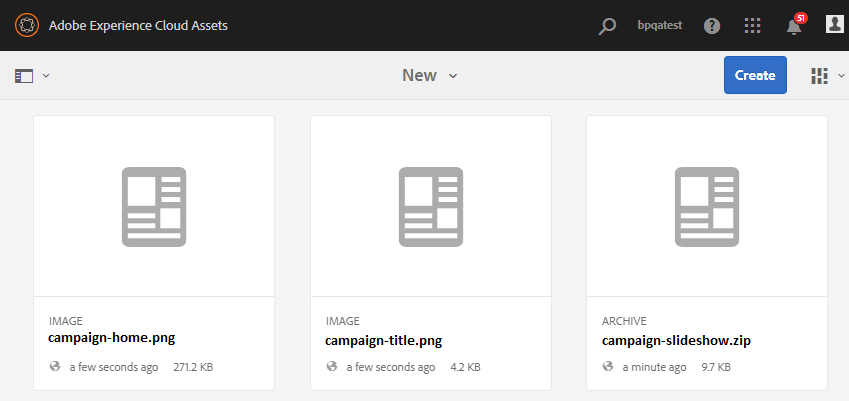
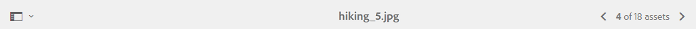

# AEM Assets Brand Portal 的新增功能 {#what-s-new-in-aem-assets-brand-portal}

Adobe Experience Manager(AEM)Assets Brand Portal可帮助您轻松获取、控制获准的创意资产并跨设备安全地将其分发给外部方和内部业务用户。 它有助于提高资产共享的效率，加快资产的上市时间，并降低不合规和未授权访问的风险。 Adobe正致力于改善整体品牌门户体验。 抢先领略新增功能和增强功能。

## 6.4.6中的更改 {#what-changed-in-646}

在Brand Portal 6.4.6中，AEM资产与Brand Portal之间的授权渠道已更改。 AEM Assets云服务、AEM Assets 6.3及更高版本现在支持Brand Portal。 在AEM Assets 6.3及更高版本中，Brand Portal先前已通过旧版OAuth网关在经典UI中配置，该网关使用JWT令牌交换获取IMS访问令牌进行授权。 AEM资产现在通过Adobe I/O配置了Brand Portal，后者为Brand Portal租户购买IMS令牌以授权。

<!-- The steps to configure integration are different depending on your AEM version, and whether you are configuring for the first-time, or upgrading the existing integration:
-->

<!--
  
   | **AEM Version** |**New Integration** |**Upgrade Integration** |
|---|---|---|
| **AEM 6.5** |[Create new integration](../using/brand-portal-configure-integration-65.md) |[Upgrade existing integration](../using/brand-portal-configure-integration-65.md#upgrade-integration-65) | 
| **AEM 6.4** |[Create new integration](../using/brand-portal-configure-integration-64.md) |[Upgrade existing integration](../using/brand-portal-configure-integration-64.md#upgrade-integration-64) | 
| **AEM 6.3** |[Create new integration](../using/brand-portal-configure-integration-63.md) |[Upgrade existing integration](../using/brand-portal-configure-integration-63.md#upgrade-integration-63) | 
| **AEM 6.2** |Contact Support |Contact Support | 

   -->

根据您的AEM版本以及您是首次配置还是升级现有配置，配置带有Brand Portal的AEM资产的步骤有所不同：

<!--| **AEM Version** |**New Configuration** |**Upgrade Configuration** |
|---|---|---|
| **AEM 6.5 (6.5.4.0 and above)** |[Create configuration](../using/brand-portal-configure-integration-65.md) |[Upgrade configuration](../using/brand-portal-configure-integration-65.md#upgrade-integration-65) | 
| **AEM 6.4 (6.4.8.0 and above)** |[Create configuration](../using/brand-portal-configure-integration-64.md) |[Upgrade configuration](../using/brand-portal-configure-integration-64.md#upgrade-integration-64) | 
| **AEM 6.3 (6.3.3.8 and above)** |[Create configuration](../using/brand-portal-configure-integration-63.md) |[Upgrade configuration](../using/brand-portal-configure-integration-63.md#upgrade-integration-63) | 
| **AEM 6.2** |Contact Support |Contact Support | 
-->

<!-- AEM Assets configuration with Brand Portal on Adobe I/O is supported on:
* AEM 6.5.4.0 and above
* AEM 6.4.8.0 and above
* AEM 6.3.3.8 and above -->

| **AEM 版本** | **新配置** | **升级配置** |
|---|---|---|
| **AEM Assets 云服务** | [创建配置](https://docs.adobe.com/content/help/en/experience-manager-cloud-service/assets/brandportal/configure-aem-assets-with-brand-portal.html) | - |
| **AEM 6.5（6.5.4.0及更高版本）** | [创建配置](https://docs.adobe.com/content/help/en/experience-manager-65/assets/brandportal/configure-aem-assets-with-brand-portal.html) | [升级配置](https://docs.adobe.com/content/help/en/experience-manager-65/assets/brandportal/configure-aem-assets-with-brand-portal.html#upgrade-integration-65) |
| **AEM 6.4（6.4.8.0及更高版本）** | [创建配置](https://docs.adobe.com/content/help/en/experience-manager-64/assets/brandportal/configure-aem-assets-with-brand-portal.html) | [升级配置](https://docs.adobe.com/content/help/en/experience-manager-64/assets/brandportal/configure-aem-assets-with-brand-portal.html#upgrade-integration-64) |
| **AEM 6.3（6.3.3.8及更高版本）** | [创建配置](https://helpx.adobe.com/experience-manager/6-3/assets/using/brand-portal-configuring-integration.html) | [升级配置](https://helpx.adobe.com/experience-manager/6-3/assets/using/brand-portal-configuring-integration.html#Upgradeconfiguration) |
| **AEM 6.2** | 联系支持 | 联系支持 |

>[!NOTE]
>
>建议将AEM实例更新到最新的Service Pack。

请参阅最 [新的Brand Portal发行说明](brand-portal-release-notes.md)。

请参 [阅Brand Portal常见问题解答](brand-portal-faqs.md)。

## 6.4.5中的更改 {#what-changed-in-645}

Brand Portal 6.4.5 是一个功能版本，其主要是为 Brand Portal 用户（外部代理/团队）提供在不需要访问作者环境的情况下将内容上传到 Brand Portal 并发布到 AEM Assets 的功能。此功能在Brand Portal中称为 **[Asset Sourcing](brand-portal-asset-sourcing.md)**，它通过为用户提供双向机制来与全球分布的其他Brand Portal用户共同贡献和共享资产，从而改善客户体验。

### Brand Portal中的资产来源补充 {#asset-sourcing-in-bp}

资产来源补充允许AEM用户（管理员／非管理员用户）使用其他“资产贡献 **** ”属性创建新文件夹，确保创建的新文件夹可由Brand Portal用户打开以提交资产。 这会自动触发一个工作流，该工作流会在新创建的 **Contribution** 文件夹内创建另外两个子文件夹，称为NEW和SHARED。

然后，AEM用户定义了此要求，方法是将应添加到贡献文件夹的资产类型的简介以及将基准资产 [上传到](brand-portal-configure-contribution-folder-properties.md) SHARED [文件夹](brand-portal-upload-baseline-assets.md)**** ，以确保BP用户获得他们需要的参考信息。 然后，管理员可以在将新创建的Contribution文件夹发布到Brand Portal之前，向活动的Brand Portal用户授予对贡献文件 **夹的访问权** 。

用户完成在 **NEW** 文件夹中添加内容后，他们可以将贡献文件夹发布回AEM作者环境。 请注意，完成导入并反映AEM资产中新发布的内容可能需要几分钟时间。

此外，所有现有功能都保持不变。 Brand Portal用户可以从贡献文件夹以及其他允许的文件夹视图、搜索和下载资产。 管理员还可以进一步共享贡献文件夹、修改属性以及向集合添加资产。

>[!NOTE]
>
>AEM 6.5.2.0及更高版本支持品牌门户中的资产来源补充。
>
>早期版本（AEM 6.3和AEM 6.4）不支持此功能。

### 将资产上传到贡献文件夹 {#upload-assets-in-bp}

具有相应权限的Brand Portal用户可以下 [载资产要求](brand-portal-download-asset-requirements.md) ，以了解贡献的需求，并将包含多个资产的多个资产或文件夹上传到贡献文件夹。 但是，请注意，Brand Portal用户只能将资产上传到 **NEW** 子文件夹。 SHARED **文件夹** ，用于分发要求和基准资产。 请参阅，将 [资产上传到贡献文件夹](brand-portal-upload-assets-to-contribution-folder.md)

### 将贡献文件夹发布到AEM资产 {#publish-assets-to-aem}

上传完成到NEW文件 **夹后** ,Brand Portal用户随后可以将贡献文件夹发布回AEM。 在AEM资产中导入和反映已发布的内容／资产可能需要几分钟时间。 请参阅，将 [贡献文件夹发布到AEM资产](brand-portal-publish-contribution-folder-to-aem-assets.md)

## 6.4.4中的更改 {#what-changed-in-644}

Brand Portal 6.4.4 版主要增强了文本搜索和常见客户请求。请参阅最 [新的Brand Portal发行说明](brand-portal-release-notes.md)。

### 搜索增强功能 {#search-enhancements}

从Brand Portal 6.4.4开始，支持对筛选窗格中的属性谓词进行部分文本搜索。 要允许部分文本搜索，您需要在搜索表单中 **的属性谓词中启用** “部分搜索”。

继续阅读以了解有关部分文本搜索和通配符搜索的更多信息。

#### 部分短语搜索 {#partial-phrase-search}

您现在可以通过在筛选窗格中仅指定搜索短语的一个或两个部分来搜索资产。

**用例部**&#x200B;分短语搜索在您不确定搜索的短语中出现的词语的确切组合时很有帮助。

例如，如果您在Brand Portal中的搜索表单使用属性谓词对资产标题进行部分搜索，则指定术语 **camp** 将返回标题短语中带有单词camp的所有资产。

#### 通配符搜索 {#wildcard-search}

Brand Portal允许在搜索查询中使用星号(*)，并在搜索短语中使用部分单词。

**用例**&#x200B;如果您不确定搜索的短语中出现的确切单词，可以使用通配符搜索来填补搜索查询中的空白。

例如，指定 **climb******* ，如果Brand Portal中的搜索表单使用属性谓词对资产标题进行部分搜索，则返回所有资产，其标题短语中的单词以字符climp开头。

同样，指定：

* ***climp** 返回所有单词以字符 **clamp** 结尾的资产。

* ***climb*** 返回所有包含词的资源，这些词的标题词 **中包含** “clipt”字符。

>[!NOTE]
>
>在选中“部 **分搜索** ”复选框时， **默认情况下会选中“忽略大小写** ”。

## 6.4.3中的更改 {#what-changed-in}

Brand Portal 6.4.3版本侧重于— 除了在Brand Portal访问URL中的租户ID之外，还为组织提供了替代别名、新文件夹层次结构配置、视频支持增强、从AEM作者实例到Brand Portal的计划发布、操作增强— 和客户请求的类别。

### 非管理员的文件夹层次结构导航

管理员现在可以配置文件夹在登录时向非管理员用户（编辑者、查看者和客人用户）显示的方式。 [“启用文件夹层次结构](../using/brand-portal-general-configuration.md) ”配置将添加在“ **常规设置**”中，位于管理工具面板中。 如果配置为：

* **启用**&#x200B;后，从根文件夹开始的文件夹树对非管理员用户可见。 因此，可授予他们类似于管理员的导航体验。
* **禁用**,登陆页上只显示共享文件夹。

用**例**

启用 [文件夹层次结构功能](../using/brand-portal-general-configuration.md) （启用后）可帮助您区分名称与从不同层次结构共享的文件夹。 登录后，非管理员用户现在可以看到共享文件夹的虚拟父（和上级）文件夹。
 

共享文件夹在虚拟文件夹的各个目录中进行组织。 您可以通过锁定图标识别这些虚拟文件夹。

请注意，虚拟文件夹的默认缩略图是第一个共享文件夹的缩略图。

### 在特定文件夹层次结构或路径中搜索

**路径浏览器谓词** (Path Browser predicate is in the Search Form)在搜索表单中引入，以允许搜索特定目录中的资产。 路径浏览器的搜索谓词的默认搜索路径 `/content/dam/mac/<tenant-id>/`是，可通过编辑默认搜索表单来配置。

* 管理员用户可以使用路径浏览器导航到Brand Portal上的任意文件夹目录。
* 非管理员用户可以使用路径浏览器仅导航到与他们共享的文件夹（并导航回父文件夹）。
例如， `/content/dam/mac/<tenant-id>/folderA/folderB/folderC` 与非管理员用户共享。 用户可以使用路径浏览器在folderC内搜索资产。 此用户还可以导航到folderB和folderA（因为它们是与用户共享的folderC的祖先）。

**用例**

您现在可以限制在您浏览到的特定文件夹中搜索资产，而不是从根文件夹开始。

请注意，在这些文件夹下进行搜索只会返回与用户共享的资产的结果。

### Dynamic Media视频再现支持

AEM作者实例处于Dynamic Media混合模式的用户除了可以预览原始视频文件外，还可以下载Dynamic Media再现。

要允许在特定租户帐户上预览和下载Dynamic Media再现，管理员需要从管理工具面板中在视频配置中指定 **Dynamic Media****** Configuration(视频服务URL(DM-Gateway URL)和注册ID来获取动态视频)。

**可以在**&#x200B;以下位置预览Dynamic Media视频的用例：

* 资产详细信息页面
* 资产的卡视图
* 链接共享预览页

Dynamic Media视频编码可从以下位置下载：

* Brand Portal
* 共享链接

### 计划发布到Brand Portal

可以将资产（和文件夹）从 [AEM(6.4.2.0)](https://helpx.adobe.com/experience-manager/6-4/release-notes/sp-release-notes.html#main-pars_header_9658011) “作者”实例发布到Brand Portal的工作流安排在以后的日期、时间内。

同样，通过计划从Brand Portal中取消发布工作流，可以在以后的日期（时间）从门户中删除已发布的资产。

### URL中可配置的租户别名

组织可以通过在URL中具有替代前缀来自定义其门户URL。 要在其现有门户URL中获取租户名称的别名，组织需要联系Adobe支持部门。

请注意，只能自定义品牌门户URL的前缀，而不能自定义整个URL。\
例如，具有现有域 **geometrix.brand-portal.adobe.com的组织可以获取** geometrixinc.brand-portal.adobe.com **** （根据请求创建）。

但是，AEM作者实例只能 [使用租户](https://helpx.adobe.com/experience-manager/6-5/assets/using/brand-portal-configuring-integration.html) ID URL配置，而不能使用租户别名（备用）URL配置。

**用例组**&#x200B;织可以通过自定义门户URL而不是坚持Adobe提供的URL来满足其品牌需求。

### 下载体验增强功能

发行优惠通过减少点击次数和警告次数简化了下载体验，具体内容如下：

* 选择仅下载演绎版（而非原始资产）。
* 当访问原始演绎版受限时，下载资产。

## 6.4.2中的更改 {#what-changed-in-1}

Brand Portal 6.4.2版本提供了一系列功能，可满足组织的资产分发需求，并帮助他们接触到通过客人访问和最佳下载体验在全球分布的大量用户。 Brand Portal还通过管理员的新配置、新添加的报告以及迎合客户请求为组织提供更大的控制。

### 客人访问

AEM Brand门户允许客人访问门户。 客人用户不需要凭据即可进入门户，并且可以访问和下载所有公共文件夹和集合。 客人用户可以将资产添加到其Lightbox（私人收藏集）并下载相同的资产。 他们还可以视图管理员设置的智能标记搜索和搜索谓词。 客人会话不允许用户创建集合和保存的搜索或进一步共享它们、访问文件夹和集合设置以及将资产共享为链接。

在组织中，允许多个并发客人会话，此会话限制为每个组织的用户配额总数的10%。

客人会话在两小时内保持活动状态。 因此，灯箱的状态也会保留到会话开始时间起的两小时。 两小时后，客人会话必须重新启动，因此lightbox状态会丢失。

### 加速下载

Brand Portal用户可以利用基于IBM Aspera Connect的快速下载，将下载速度提高25倍，并享受无缝下载体验，无论他们位于全球哪个位置。 要从Brand Portal或共享链接更快地下载资产，用户需要在下载对话框中选择“启用下载加速 **** ”选项，前提是组织中启用了下载加速。

要为组织启用基于IBM Aspera的加速下载，管理员可从管理工具面板的“常规设置”中启用“启用下载加速 **”选项(默** 认情况下为禁用  )。 要进一步了解从Brand Portal和共享链接更快下载资产文件的先决条件和疑难解答步骤，请参阅 [指南以加速从Brand Portal下载](../using/accelerated-download.md#main-pars-header)。

### 用户登录报告

新的报告已引入，用于跟踪用户登录情况。 “用 **户登录** ”报告有助于组织审核和检查已委派管理员和品牌门户的其他用户。

报告从Brand Portal 6.4.2部署到生成报告时，将记录每个用户的显示姓名、电子邮件ID、角色（管理员、查看器、编辑器、客人）、用户组、上次登录、活动状态和登录计数。 管理员可以将报告导出为。csv。 除了其他报告，“用户登录”报告还使组织能够更密切地监控用户与已批准品牌资源的交互情况，从而确保符合公司合规办公室的要求。

### 访问原始演绎版

管理员可以限制用户访问原始图像文件(.jpeg、.tiff、.png、.bmp、.gif、.pjpeg、x-portable-anymap、x-portable-bitmap、x-probatle-graymap、x-portable-pixmap、x-rgb、x-xbitmap、x-icon、image/photoshop、.psoshop、image/vnd.adobe.photoshop)，并授予低分辨率访问权限再现，它们从Brand Portal或共享链接下载。 此访问权限可以在用户组级别控制，该权限位于管理工具面板中“用户角色”页面的“组”选项卡中。

* 默认情况下，所有用户都可以下载原始演绎版，因为“访问原始”已为所有用户启用。
* 管理员需要取消选中相应的复选框，以阻止一组用户访问原始演绎版。
* 如果用户是多个用户组的成员，但只有其中一个用户组具有限制，则这些限制适用于该用户。
* 这些限制不适用于管理员，即使管理员是受限用户组的成员。
* 将资产共享为链接的用户的权限适用于使用共享链接下载资产的用户。

### 卡和列表视图上的文件夹层次结构路径

在卡视图中，文件夹的卡现在向非管理员用户（编辑者、查看者和客人用户）显示文件夹层次结构信息。 此功能可让用户了解文件夹的位置，以及他们访问的与父层次结构相关的文件夹。

文件夹层次结构信息对于区分名称与从不同文件夹层次结构共享的其他文件夹相似的文件夹特别有用。 如果非管理员用户不知道与他们共享的资产的文件夹结构，则名称相似的资产／文件夹似乎会令人混淆。

* 相应卡上显示的路径会被截断以适合卡的大小。 但是，用户可以将鼠标悬停在截断路径上方时，将完整路径视为工具提示。

列表视图在列中显示指向Brand Portal所有用户的资产路径。

### 视图资产属性的概述选项

Brand Portal为非管理员用户（编辑人员、查看者、客人用户）提供“概述”选项，以视图选定资产／文件夹的资产属性。 “概述”选项可见：

1. 在顶部的工具栏中，选择资产／文件夹。
2. 在下拉菜单中，选择边栏选择器。

在选择资产／文件夹时选择“概述”选项后，用户可以查看资产创建的标题、路径和时间。 但是，在资产详细信息页面上，选择“概述”选项可让用户查看资产的元数据。

## 新配置

为管理员添加了六个新配置，以针对特定租户启用／禁用以下功能：

* 允许来宾访问
* 允许用户请求访问Brand Portal
* 允许管理员从Brand Portal中删除资产
* 允许创建公共集合
* 允许创建公共智能收藏集
* 允许下载加速

以上配置位于管理工具面板中的“访问”和“常规”设置下。

### 用于配置身份验证集成的Adobe.io主机UI

从Brand Portal 6.4.2开始，使用Adobe.io [https://legacy-oauth.cloud.adobe.io/](https://legacy-oauth.cloud.adobe.io/) 界面创建JWT应用程序，该应用程序支持配置Auth集成，以允许AEM Assets与Brand Portal集成。 以前，用于配置OAuth集成的UI托管在https://marketing.adobe.com/developer/ [中](https://marketing.adobe.com/developer/)。 要了解有关将AEM资产与Brand Portal集成以将资产和集合发布到Brand Portal的更多信息，请参 [阅配置AEM资产与Brand Portal的集成](https://helpx.adobe.com/in/experience-manager/6-4/assets/using/brand-portal-configuring-integration.html)。

## 搜索增强功能

管理员可以使用更新的属性谓词使属性谓词不区分大小写，该谓词已选中“忽略大小写”。 此选项适用于属性谓词和多值属性谓词。\
但是，非区分大小写的搜索比属性谓词的默认搜索速度要慢。 如果搜索筛选器中存在太多非区分大小写的谓词，则搜索可能会减慢。 因此，建议谨慎使用非区分大小写的搜索。

## 6.4.1中的更改 {#what-changed-in-2}

Brand Portal 6.4.1是一个平台升级版本，它引入了多项新功能和重要增强功能，如浏览、搜索和性能增强，可以提供充分的客户体验。

### 浏览增强功能

* 新内容树边栏可快速导航资产层次结构。

* 引入了新的键盘快捷键， _例如_ (p)用于导航到属性页面， _(e)用于编辑，_ (ctrl+c) __ 用于复制操作。
* 改进了卡和列表视图中用于浏览大量资源的滚动、延迟加载体验。
* 增强的卡视图，支持基于视图设置的不同大小的卡。

* 卡视图现在可在将鼠标悬停在日期标签上方时显示日期／时间戳。

* 增强的列视图，其 **中包含资产快照** ，您可以通过该快照导航到资产的详细信息页面。

* 列表视图现在默认显示第一列中资产的文件名以及区域设置、资产类型、尺寸、大小、评级和发布信息。 新 **的视图设置** ，可用于配置要在列表视图中显示的详细信息量。

* 改进了资产详细信息体验，能够使用新的导航按钮在资产之间来回导航，并视图资产计数。

* 预览从AEM上传的音频文件在资产详细信息页面中的新功能。
* 资产属性中提供的新相关资产功能。 与AEM上的其他源／派生资产相关并在Brand Portal上发布的资产现在在Brand Portal中保持其关系不变，并在属性页面上提供指向相关资产的链接。
* 已引入限制非管理员用户创建公共集合的新配置。 组织可以与Adobe支持团队合作，在特定帐户上配置此功能。

### 搜索增强功能

* 引入的功能可在导航到搜索项后返回到搜索结果中的同一位置，而无需再次运行搜索查询。
* 新的搜索结果计数用于显示已提供的搜索结果数。
* 改进的“文件类型搜索筛选器”能够根据细粒度的MIME类型（如。jpg、.png和。psd）筛选搜索结果，而之前的“图像”、“文档”和“多媒体”选项则不如此。
* 增强了集合的搜索过滤器，具有精确的时间戳而不是以前的时间滑块功能。
* 已引入新的访问类型过滤器来搜索公开或非公开的集合。

### 下载优化

* 直接下载单个大文件，无需创建zip文件，从而提高了速度和吞吐量。
* 链接共享功能的Zip下载限制从1GB增加到5GB。

* 用户现在可以选择仅下载自定义和原始文件，并防止开箱即用的再现，同时从Brand Portal或通过共享链接功能下载资产。

### 性能增强

* 资产下载速度提高了100%。
* 资产搜索响应提高40%。
* 浏览性能提高40%。

**注意**:根据实验室进行的测试，引用了一些改进。

### 增强的报告功能

**引入链接共享**&#x200B;报告为提供共享链接的相关信息，引入了新的报告。 “链接共享”报告将所有URL列表到资产，并在指定的时间范围内与组织内的内部和外部用户共享。 它还会通知链接何时共享、由谁共享以及何时过期。

**修改了访问使用情况报告的入口点**。使用情况报告现在与其他报告整合在一起，现在可以从资产报告控制台中查看。 要进入“资产报表”控制台，请从管理 **工具面板导航到创建／管理** “报表”。

**通过Brand Portal上的报告**&#x200B;报告界面改进的用户体验变得更直观，并对组织实现更好的控制。 除了创建各种报告外，管理员现在还可以重新访问生成的报告并下载或删除它们，因为这些报告保存在Brand Portal中。

可通过添加或删除默认列来自定义所创建的每个报告。 此外，可以将自定义列添加到“下载”、“过期”和“发布”报表，以控制其粒度程度。

### 改进的管理工具

改进了元数据、搜索和报告管理工具中的属性选取器，该工具具有提前键入和浏览功能，可简化管理体验。

### 其他增强功能

* 现在，通过在AEM Assets Brand Portal复制对话框中标记“公共文件夹发布”复选框，可以将从AEM 6.3.2.1和6.4发布到Brand Portal的资产公开提供给Brand Portal的常规用户。

* 如果有人请求访问Brand Portal，则管理员将通过访问请求电子邮件获得通知，但Brand Portal通知区域中的通知除外。

## 6.3.2中的更改 {#what-changed-in-3}

Brand Portal 6.3.2包含面向热门客户请求的新增和增强功能以及一般性能增强。

### Request access to Brand Portal {#request-access-to-brand-portal}

用户现在可以使用Brand Portal登录屏幕上提供的 **新需求访问** ，请求访问Brand Portal。

根据用户是否具有Adobe ID，或是否需要创建Adobe ID，用户可以按照相应的工作流程提交请求。 Brand Portal产品管理员在其通知区域收到此类请求，并通过Adobe Admin Console授予访问权限。

有关详细信息，请参 [阅请求对Brand Portal的访问权](../using/brand-portal.md#requestaccesstobrandportal)。

### 资产下载报告中的增强功能 {#enhancement-in-the-assets-downloaded-report}

资产下载报告现在包括指定日期和时间范围内每位用户的资产下载计数。 用户可以以。csv格式下载此报告并编译数据，如许可资产的总下载计数。

有关详细信息，请参阅创建和管理其他报 [告中的步骤3和6](../using/brand-portal-reports.md#createandmanageadditionalreports)。

### Brand Portal维护通知 {#brand-portal-maintenance-notification}

Brand Portal现在在即将进行的维护活动前几天显示通知横幅。 示例通知：

有关详细信息，请参阅 [Brand Portal维护通知](https://helpx.adobe.com/experience-manager/brand-portal/using/brand-portal.html#BrandPortalmaintenancenotification)。

### 使用链接共享功能增强共享的许可资源 {#enhancement-for-licensed-assets-shared-using-the-link-share-feature}

使用链接共享功能下载许可资产时，系统会提示您同意这些资产的许可协议。

有关详细信息，请参阅将资产作 [为链接共享中的步骤12](../using/brand-portal-link-share.md#shareassetsasalink)。

### 用户选取器增强功能 {#user-picker-enhancement}

用户选取器性能现已增强，以满足拥有大量用户群的客户的需求。

### Experience Cloud品牌变更 {#experience-cloud-branding-changes}

Brand Portal现在符合新的Adobe Experience Cloud品牌。

## 6.3.1中的更改 {#what-changed-in-4}

Brand Portal 6.3.1包含面向将Brand Portal与AEM协调的新增和增强功能。

### 升级的用户界面 {#upgraded-user-interface}

要使Brand Portal用户体验与AEM保持一致，Adobe将过渡到Coral 3用户界面。 此更改增强了整体可用性，包括导航和外观。

#### 增强的导航体验 {#enhanced-navigational-experience}

* 通过新的Adobe徽标快速访问管理工具：

* 通过叠加进行产品导航：

* 快速导航到父文件夹：

* 快速搜索并导航到所需的内容和工具：

### 增强的浏览体验 {#enhanced-browsing-experience}

* 用于浏览嵌套文件夹的新列视图:

 

* 在文件夹中资产的列表中，最新上传的资产会显示在顶部。

### 增强的搜索体验 {#enhanced-search-experience}

* 全新的Omni搜索功能便于您在键入搜索关键字时通过自动建议快速访问相关内容、功能或标记。 Omni搜索功能适用于所有搜索功能。

* 您还可以向Omni搜索添加搜索过滤器，以进一步缩小搜索范围并加快搜索速度。

* 通过基于评级的新资产搜索功能，您可以搜索从AEM资产中发布的具有评级的资产。
* 新的多值搜索功能通过AND运算符接受多个关键字以更快地发现资源。
* 新的搜索提升功能可让您提高搜索相关性，以便特定资产显示在搜索结果的顶部。
* 使用基于路径的新搜索功能，您可以提供嵌套文件夹的路径，以便能够搜索该文件夹中的资产。

#### 基于智能标记的全新搜索 {#new-smart-tags-based-search}

如果具有智能标记的图像从AEM资产发布到Brand Portal，则可以在Brand Portal中使用智能标记名称作为搜索关键字搜索这些图像。 此功能仅对文件可用。

### 增强的下载体验 {#enhanced-downloading-experience}

下载嵌套文件夹后，您可以保留原始文件夹层次结构。 嵌套文件夹内的资源可下载到单个文件夹中，而不是可下载到单独的文件夹中。

### 改进的性能 {#improved-performance}

浏览、搜索和下载功能中的增强功能显着提高了Brand Portal的性能。

### New digital rights management for assets {#new-digital-rights-management-for-assets}

管理员可以在共享资产之前设置资产的到期日期和时间。 资产过期后，查看者和编辑者可看到该资产，但无法下载。 当资产过期时，管理员会收到通知。

### 增强的资源排序 {#enhanced-asset-sorting}

在列表视图中对文件夹中的资产排序不再局限于第一页上显示的资产数量。 无论是否在第一页中列出所有资产，都会对文件夹中的所有资产进行排序。

### 增强的报告 {#reporting-capabilities}

管理员可以创建和管理三种类型的报告——已下载、已过期和已发布的资产。 还可以配置报告中的列，并将报告导出为CSV格式。

### 其他元数据 {#additional-metadata}

Brand Portal 6.3.1引入了其他元数据，与AEM Assets 6.3相同。您可以使用模式编辑器表单控制应在资产属性页面上显示的元数据。 资产元数据对于外部链接共享用户不可见，他们只能使用链接共享URL预览和下载资产。

### 管理员的其他功能 {#additional-capabilities-for-administrators}

* 在完成对登录屏幕墙纸的自定义设置之前，管理员可以预览更改。

* 管理员添加新用户后，他们无需接受邀请即可添加到Brand Portal，而是会自动添加这些用户。

### AEM Assets 6.3中的新发布功能 {#new-publishing-capabilities-in-aem-assets}

* AEM管理员可以使用AEM 6.3 SP 1-CFP 1(6.3.1.1)将元数据模式从AEM资产发布到Brand Portal，该功能将在2017年第4季度发布。

* AEM管理员可以使用AEM 6.2 SP1-CFP7和AEM 6.3 SP 1-CFP 1(6.3.1.1)将所有标记从AEM资产发布到Brand Portal。

* 从AEM资产中，您可以发布具有标记（包括智能标记）的资产和收藏集。 然后，您可以在Brand Portal中使用这些标记作为搜索关键字搜索这些资产或集合。