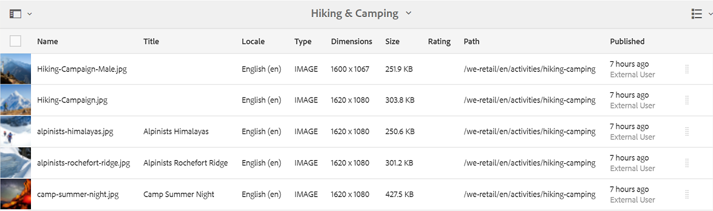
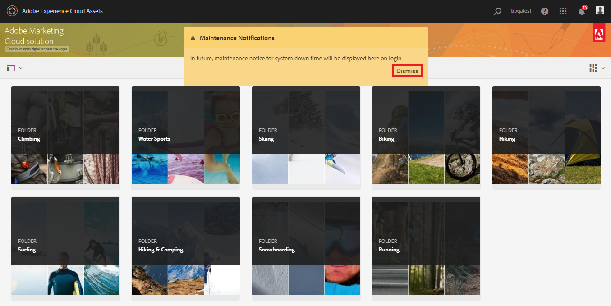

# AEM Assets Brand Portal 的新增功能 {#what-s-new-in-aem-assets-brand-portal}

Adobe Experience Manager(AEM)Assets Brand Portal可帮助您轻松获取、控制获准的创意资产并跨设备安全地将其分发给外部方和内部业务用户。 它有助于提高资产共享的效率，加快资产的上市时间，并降低不合规和未经授权访问的风险。 Adobe正在努力改善整体品牌门户体验。 抢先领略新增功能和增强功能。

## 2020.10.0中的更改 {#what-changed-in-oct-2020}

Brand Portal 2020.10.0是一个增强版本，侧重于简化资产下载体验并包含关键修复。 该增强功能包括用于资产下载的全新和经过改进的工作流、排除再现的其他选项、从演绎版 **[!UICONTROL 面板直接下载]** 、允许特定用户组访问和下载权限的配置，以及从所有品牌门户页面轻松导航到文件、集合和共享链接。 请参阅最 [新的Brand Portal发行说明](brand-portal-release-notes.md)。

### 简化的下载体验 {#download-dialog}

以前，会显 **[!UICONTROL 示]** “下载”对话框，其中包含多个选项，如为每个资产创建单独的文件夹、电子邮件资产、选择原始资产、自定义演绎版、动态演绎版、排除系统演绎版并启用下载加速，这些选项对于非技术用户或新用户来说很模糊，尤其是当选择了多个资产或文件夹进行下载时。 此外，用户无法查看所有资产演绎版或排除特定的自定义或动态演绎版。

新的“下 **[!UICONTROL 载]** ”对话框概括了资产选择和筛选过程，使Brand Portal用户在下载资产演绎版时能更轻松地做出有效决策。 它会根据“下载”配置和“下载”设置来列表所 [**[!UICONTROL 有选定]**](brand-portal-download-assets.md) 的资产 **[!UICONTROL 及其演绎]** 版。

>[!NOTE]
>
>所有用户现在都将 **[!UICONTROL 默认启用]** “快速下载”，并要求在从Brand Portal下载资源之前，在浏览器扩展中安装IBM Aspera Connect 3.9.9。

<!--
If any of the **[!UICONTROL Custom Rendition]** or **[!UICONTROL System Rendition]** is enabled in the [**[!UICONTROL Download]**](brand-portal-download-assets.md) configuration and **[!UICONTROL Download]** settings are enabled for the group users, the new **[!UICONTROL Download]** dialog appears with all the renditions of the selected assets or folders containing assets in a list view. 
-->

从“下 **[!UICONTROL 载]** ”对话框中，用户可以：

* 视图下载列表中任何资产的所有可用演绎版。
* 排除不需要下载的资产演绎版。
* 只需单击一次，即可将同一组演绎版应用于所有类似的资产类型。
* 对不同资产类型应用不同的演绎版集。
* 为每个资产创建单独的文件夹.
* 下载选定资产及其演绎版。

对于独立资产、多个资产、包含资产的文件夹、授权或未授权的资产，以及使用共享链接下载资产，下载工作流程将保持不变。 请参 [阅从Brand Portal下载资产的步骤](https://docs.adobe.com/content/help/en/experience-manager-brand-portal/using/download/brand-portal-download-assets.html#download-assets)。

### 快速导航  {#quick-navigation}

以前，“视图文 **[!UICONTROL 件]**、集合和共享链接 **[!UICONTROL ”选项是]****** 隐藏的，用户每次要切换到其他视图，都需要多次单击。

在Brand Portal 2020.10.0中，用户可使用快速导航链 **[!UICONTROL 接从所有Brand Portal页面]**，一键导航 **[!UICONTROL 到文]**&#x200B;件、集合 **[!UICONTROL 和共享链接]** 。

### 增强的再现面板 {#rendition-panel}

以前，如果在下载配置中启用了任何自定义演绎版或系统演绎版，则用户只能在 **[!UICONTROL “演绎版]** ”面板中视图原始资产及其 **[!UICONTROL 演绎]********** 版。 此外，用户还必须下载所有资产演绎版，因为没有过滤器可排除不需要的特定自定义或动态演绎版。

<!--
Earlier, if any of the custom or system renditions was enabled in the **[!UICONTROL Download]** settings, an additional **[!UICONTROL Download]** dialog appeared on clicking the **[!UICONTROL Download]** button wherein the user had to manually select the set of renditions (original asset, custom renditions, dynamic renditions) to download.
There was no filter to exclude specific custom or dynamic renditions which were not required for download.
-->

在Brand Portal 2020.10.0中，用户可以排除特定演绎版并直接从资产详细信息页面 [的“演绎版](brand-portal-download-assets.md#download-assets-from-asset-details-page) ”面板下载选定的演绎版 **[!UICONTROL ，而无需打开“下载]** ”对话框。

<!-- 
In Brand Portal 2020.10.0, direct download and exclude renditions features are introduced in the **[!UICONTROL Renditions]** panel on the asset details page. All the renditions (original asset, custom renditions, dynamic renditions) under the rendition panel are now associated with a check box and are enabled by default. 

The user can clear the check boxes to exclude the renditions which are not required for download. And can click on the **[!UICONTROL Download]** button in the **[!UICONTROL Renditions]** panel to directly download the selected set of renditions in a zip folder without having to open the **[!UICONTROL Download]** dialog.
-->

### 配置下载权限 {#download-permissions}

除了现有的下载 **[!UICONTROL 配置]** ,Brand Portal管理员还可以配置不同用户组的视图权限，并（或）从资产详细信息页面下载原始资产及其演绎版。

以管理员身份登录到您的Brand Portal租户，然后导航到 **[!UICONTROL 工具]** > **[!UICONTROL 用户]**。

在“用 **[!UICONTROL 户角色]** ”页中，导航到“ **[!UICONTROL 组]** ”选项卡，以配置用户组的视图和（或）下载权限

以前，这些设置仅用于限制用户组下载原始资产。

“用 **[!UICONTROL 户角]** 色 **[!UICONTROL ”页上的“组]** ”选项卡允许管理员配置视图和下载设置：

* 如果同时 **[!UICONTROL 打开]** “下 **[!UICONTROL 载原始资产”和]** “下载演绎版”设置，则选定组的用户可以视图和下载原始资产及其演绎版。
* 如果两个设置都处于关闭状态，则用户只能视图原始资产。 资产演绎版对资产详细信息页面上的用户不可见。
* 如果只 **[!UICONTROL 启用了]** “下载原件”设置，则用户只能从资产详细信息页面视图和下载原始资产。
* 如果仅 **[!UICONTROL 启用了]** “下载演绎版”设置，则用户可以视图原始资产，但无法下载它。 但是，用户可以视图和下载资产演绎版。

请参阅 [配置资产下载](https://docs.adobe.com/content/help/en/experience-manager-brand-portal/using/download/brand-portal-download-assets.html#configure-download-permissions)。

>[!NOTE]
>
>如果将用户添加到多个组，并且其中一个组具有限制，则限制将适用于该用户。

<!--
>Restrictions to access the original asset and their renditions do not apply to administrators even if they are members of restricted groups.
 >
 >The users can always download assets and their renditions from the repository using a `curl` request even if the download configurations are turned-off.
 >
-->

## 6.4.7中的更改 {#what-changed-in-647}

Brand Portal 6.4.7版本引入了文档查看器，增强了下载资产的体验，并包含关键修复。 请参阅最 [新的Brand Portal发行说明](brand-portal-release-notes.md)。

<!--
Brand Portal 6.4.7 release brings in the Document Viewer, leverages the Brand Portal administrators to configure asset download, and centers top customer requests. See latest [Brand Portal Release Notes](brand-portal-release-notes.md).
-->

### 文档查看器 {#doc-viewer}

文档查看器增强了PDF查看体验。 在Brand Portal中查看PDF文件时，它提供的体验与Adobe Document Cloud类似。

以前，视图PDF文件时有限的选项可用。

借助文档查看器，Brand Portal用户现在可以选择视图页面、视图书签、搜索页面文本、放大、缩小、导航到上一页和下一页、切换到页面、适合窗口、适合屏幕以及隐藏或取消隐藏工具栏。

>[!NOTE]
>
>其他文档格式的查看体验保持不变。

### 下载体验 {#download-configurations}

改进了资产下载过程，在从Brand Portal下载资产时提供 [了简化的用户体验](brand-portal-download-assets.md)。

从Brand Portal下载资产的现有工作流不可避免地会出现“下载 **** ”对话框，其中包含多个可供选择的下载选项。

在Brand Portal 6.4.7中，Brand Portal管理员可以配置资产下载 **[!UICONTROL 设]** 置。 可用的配置有：
* **[!UICONTROL 快速下载]**
* **[!UICONTROL 自定义呈现版本]**
* **[!UICONTROL 系统呈现版本]**

Brand Portal管理员可以启用任何组合来配置资产下载。

<!--In Brand Portal 6.4.7, fast download, custom renditions, and system renditions are the three configurations available.-->

* 如果关 **[!UICONTROL 闭了“自定]** 义演绎版 **[!UICONTROL ”和“系统演绎版]** ”配置，则下载资产的原始演绎版时无需任何其他对话框，从而简化了Brand Portal用户的下载体验。

* 如果启用了任 **[!UICONTROL 何“自定]** 义演绎版 **[!UICONTROL ”或“系统演绎版]** ”，则会显示“ **[!UICONTROL 下载]** ”对话框，并下载原始资产以及资产演绎版。 启用 **[!UICONTROL “快速下载]** ”配置可加快下载过程。

根据配置，独立资产、多个资产、包含资产的文件夹、授权或未授权的资产以及使用共享链接下载资产时，下载工作流程将保持不变。

## 6.4.6中的更改 {#what-changed-in-646}

在Brand Portal 6.4.6中，AEM Assets与Brand Portal之间的授权渠道已更改。 Brand Portal现在作为AEM Assets6.3及更高版本的Cloud Service在AEM Assets受支持。 在AEM Assets6.3及更高版本中，Brand Portal先前已通过旧版OAuth网关在经典UI中配置，该网关使用JWT令牌交换获得IMS访问令牌进行授权。 AEM Assets现在通过Adobe开发人员控制台配置了品牌门户，该控制台为您的品牌门户租户购买IMS令牌以进行授权。

<!-- The steps to configure integration are different depending on your AEM version, and whether you are configuring for the first-time, or upgrading the existing integration:
-->

<!--
  
   | **AEM Version** |**New Integration** |**Upgrade Integration** |
|---|---|---|
| **AEM 6.5** |[Create new integration](../using/brand-portal-configure-integration-65.md) |[Upgrade existing integration](../using/brand-portal-configure-integration-65.md#upgrade-integration-65) | 
| **AEM 6.4** |[Create new integration](../using/brand-portal-configure-integration-64.md) |[Upgrade existing integration](../using/brand-portal-configure-integration-64.md#upgrade-integration-64) | 
| **AEM 6.3** |[Create new integration](../using/brand-portal-configure-integration-63.md) |[Upgrade existing integration](../using/brand-portal-configure-integration-63.md#upgrade-integration-63) | 
| **AEM 6.2** |Contact Support |Contact Support | 

   -->

根据AEM版本以及您是首次配置还是升级现有配置，使用Brand Portal配置AEM Assets的步骤有所不同：

<!--| **AEM Version** |**New Configuration** |**Upgrade Configuration** |
|---|---|---|
| **AEM 6.5 (6.5.4.0 and above)** |[Create configuration](../using/brand-portal-configure-integration-65.md) |[Upgrade configuration](../using/brand-portal-configure-integration-65.md#upgrade-integration-65) | 
| **AEM 6.4 (6.4.8.0 and above)** |[Create configuration](../using/brand-portal-configure-integration-64.md) |[Upgrade configuration](../using/brand-portal-configure-integration-64.md#upgrade-integration-64) | 
| **AEM 6.3 (6.3.3.8 and above)** |[Create configuration](../using/brand-portal-configure-integration-63.md) |[Upgrade configuration](../using/brand-portal-configure-integration-63.md#upgrade-integration-63) | 
| **AEM 6.2** |Contact Support |Contact Support | 
-->

<!-- AEM Assets configuration with Brand Portal on Adobe I/O is supported on:
* AEM 6.5.4.0 and above
* AEM 6.4.8.0 and above
* AEM 6.3.3.8 and above -->

| **AEM 版本** | **新配置** | **升级配置** |
|---|---|---|
| **AEM Assets 云服务** | [创建配置](https://docs.adobe.com/content/help/en/experience-manager-cloud-service/assets/brand-portal/configure-aem-assets-with-brand-portal.html) | - |
| **AEM 6.5（6.5.4.0及更高版本）** | [创建配置](https://docs.adobe.com/content/help/en/experience-manager-65/assets/brandportal/configure-aem-assets-with-brand-portal.html) | [升级配置](https://docs.adobe.com/content/help/en/experience-manager-65/assets/brandportal/configure-aem-assets-with-brand-portal.html#upgrade-integration-65) |
| **AEM 6.4（6.4.8.0及更高版本）** | [创建配置](https://docs.adobe.com/content/help/en/experience-manager-64/assets/brandportal/configure-aem-assets-with-brand-portal.html) | [升级配置](https://docs.adobe.com/content/help/en/experience-manager-64/assets/brandportal/configure-aem-assets-with-brand-portal.html#upgrade-integration-64) |
| **AEM 6.3（6.3.3.8及更高版本）** | [创建配置](https://helpx.adobe.com/experience-manager/6-3/assets/using/brand-portal-configuring-integration.html) | [升级配置](https://helpx.adobe.com/experience-manager/6-3/assets/using/brand-portal-configuring-integration.html#Upgradeconfiguration) |
| **AEM 6.2** | 联系支持 | 联系支持 |

>[!NOTE]
>
>建议将AEM实例更新到最新的Service Pack。

请参阅最 [新的Brand Portal发行说明](brand-portal-release-notes.md)。

请参 [阅Brand Portal常见问题解答](brand-portal-faqs.md)。

## 6.4.5中的更改 {#what-changed-in-645}

Brand Portal 6.4.5 是一个功能版本，其主要是为 Brand Portal 用户（外部代理/团队）提供在不需要访问作者环境的情况下将内容上传到 Brand Portal 并发布到 AEM Assets 的功能。此功能在Brand Portal **[中称为资产来源补充](brand-portal-asset-sourcing.md)**，它将通过为用户提供双向机制来与其他全球分布的Brand Portal用户共同贡献和共享资产，从而改善客户体验。

### 品牌门户中的资产来源补充 {#asset-sourcing-in-bp}

资产来源补充允许AEM用户（管理员／非管理员用户）使用其他“资产贡献 **”属性创建新文件夹** ，确保创建的新文件夹可由Brand Portal用户通过资产提交方式打开。 这会自动触发一个工作流，该工作流会在新创建的Contribution文件夹内创建另外两个子文件夹，名为NEW **和SHARED** 。

AEM用户随后定义了此 [要求](brand-portal-configure-contribution-folder-properties.md) ，将应添加到贡献文件夹的资产类型以及将基 [准资产上传到](brand-portal-upload-baseline-assets.md)SHARED **** 文件夹，以确保BP用户获得所需的参考信息。 然后，管理员可以在将新创建的Contribution文件夹发布到Brand Portal之前，向活动的Brand Portal用户授 **予对** 贡献文件夹的访问权限。

用户在NEW文件夹中添加完内 **容后** ，即可将贡献文件夹发布回AEM作者环境。 请注意，完成导入并反映AEM Assets内新发布的内容可能需要几分钟时间。

此外，所有现有功能都保持不变。 Brand Portal用户可以从贡献文件夹以及其他允许的文件夹中视图、搜索和下载资产。 此外，管理员还可以进一步共享贡献文件夹、修改属性以及向收藏集添加资产。

>[!NOTE]
>
>AEM 6.5.2.0及更高版本支持品牌门户中的资产来源补充。
>
>早期版本不支持此功能- AEM 6.3和AEM 6.4。

### 将资产上传到贡献文件夹 {#upload-assets-in-bp}

拥有适当权限的Brand Portal用户可 [以下载资产要求](brand-portal-download-asset-requirements.md) ，了解贡献的需要并将包含多个资产的多个资产或文件夹上传到贡献文件夹。 但是，请注意，Brand Portal用户只能将资产上传到NEW子文 **件夹** 。 SHARED **文件夹** ，用于分发要求和基准资产。 请参阅，将 [资产上传到贡献文件夹](brand-portal-upload-assets-to-contribution-folder.md)

### 将贡献文件夹发布到AEM Assets {#publish-assets-to-aem}

上传完成到NEW文 **件夹** 后，Brand Portal用户随后可以将贡献文件夹发布回AEM。 导入和反映在AEM Assets发布的内容／资产可能需要几分钟时间。 请参阅，将贡 [献文件夹发布到AEM Assets](brand-portal-publish-contribution-folder-to-aem-assets.md)

## 6.4.4中的更改 {#what-changed-in-644}

Brand Portal 6.4.4 版主要增强了文本搜索和常见客户请求。请参阅最 [新的Brand Portal发行说明](brand-portal-release-notes.md)。

### 搜索增强功能

从Brand Portal 6.4.4开始，支持对筛选窗格中的属性谓词进行部分文本搜索。 要允许部分文本搜索，您需要在搜 **索表单中** “属性谓词”中启用部分搜索。

阅读以进一步了解部分文本搜索和通配符搜索。

#### 部分短语搜索 {#partial-phrase-search}

您现在可以通过在筛选窗格中仅指定搜索短语的一个或两个部分来搜索资产。

**用例**&#x200B;当您不确定搜索的短语中出现的词语的确切组合时，部分短语搜索会很有帮助。

例如，如果您在Brand Portal中的搜索表单使用属性谓词对资产标题进行部分搜索，则指定术语 **camp** 将返回标题短语中带有单词camp的所有资产。

#### 通配符搜索 {#wildcard-search}

品牌门户允许在搜索查询中使用星号(*)，并在搜索的短语中使用部分单词。

**用例**&#x200B;如果您不确定搜索的短语中出现的确切词语，可以使用通配符搜索来填补搜索查询中的空白。

例如，指定 **clim*** ，如果Brand Portal中的搜索表单使用属性谓词对资产标题进行部分搜索，则返回所有包含以字 **** 符climb开头的资产。

同样，指定：

* ***clim** 返回标题短语中包含以字符 **clamp** 结尾的所有资产。

* ***climb*返回** 所有包含词汇的资产，词汇包含词 **汇的字符** （在其标题短语中）。

>[!NOTE]
>
>选中“部 **分搜索** ”复选 **框时，默认** 情况下会选择“忽略大小写”。

## 6.4.3中的更改 {#what-changed-in}

Brand Portal 6.4.3版本重点介绍——除了在Brand Portal访问URL中的租户ID外，为组织提供替代别名，新的文件夹层次结构配置，视频支持增强功能，从AEM Author实例到Brand Portal的计划发布，操作增强功能，以及客户请求的类别。

### 非管理员文件夹层次结构导航

管理员现在可以配置文件夹在登录时向非管理员用户（编辑者、查看者和来宾用户）显示的方式。 [“启用文件夹层次结构](../using/brand-portal-general-configuration.md) ”配置将添加 **到“常规设**&#x200B;置”中的管理工具面板中。 如果配置为：

* **启用**，非管理员用户将看到从根文件夹开始的文件夹树。 因此，为他们提供类似于管理员的导航体验。
* **禁用**,登陆页上仅显示共享文件夹。

启用 [文件夹层次结构](../using/brand-portal-general-configuration.md) （启用后）功能可帮助您区分名称与从不同层次结构共享的文件夹名称相同的文件夹。 登录时，非管理员用户现在可以看到共享文件夹的虚拟父（和上级）文件夹。

共享文件夹在虚拟文件夹的各个目录中进行组织。 您可以通过锁定图标识别这些虚拟文件夹。

请注意，虚拟文件夹的默认缩略图是第一个共享文件夹的缩略图。

### 在特定文件夹层次结构或路径中搜索

**路径浏览器** 谓词已在搜索表单中引入，以允许搜索特定目录中的资产。 路径浏览器的搜索谓词的默认搜索路径 `/content/dam/mac/<tenant-id>/`为，可通过编辑默认搜索表单来配置。

* 管理员用户可以使用路径浏览器导航到Brand Portal上的任意文件夹目录。
* 非管理员用户可以使用路径浏览器仅导航到与他们共享的文件夹（并导航回父文件夹）。

   例如， `/content/dam/mac/<tenant-id>/folderA/folderB/folderC` 与非管理员用户共享。 用户可以使用路径浏览器在folderC内搜索资产。 此用户还可以导航到folderB和folderA（因为它们是与用户共享的folderC的祖先）。

您现在可以限制在已浏览到的特定文件夹内搜索资产，而不是从根文件夹开始。

请注意，在这些文件夹下进行搜索只会返回已与用户共享的资产的结果。

### 动态媒体视频演绎版支持

AEM作者实例处于Dynamic Media混合模式的用户除了可以下载原始视频文件外，还可以预览和下载Dynamic Media演绎版。

要允许预览和下载特定租户帐户上的Dynamic Media再现，管理员需要在“ **Video Configuration** ”(视频服务URL(DM-Gateway URL)和注册ID，以从“Admin Tools”（管理工具）面板中 **指定Dynamic Media Configuration(视频服务URL（DM-网关URL）和注册ID)** 以获取动态视频)。

Dynamic Media视频可在以下位置预览：

* 资产详细信息页面
* 资产卡视图
* 链接共享预览页

Dynamic Media视频编码可从以下位置下载：

* Brand Portal
* 共享链接

### 计划发布到品牌门户

资产（和文件夹）从AEM( [6.4.2.0)发布工作流](https://helpx.adobe.com/experience-manager/6-4/release-notes/sp-release-notes.html#main-pars_header_9658011) ，可以将作者实例安排到Brand Portal，以后的日期和时间。

同样，可以通过计划从Brand Portal中取消发布工作流，在以后的日期（时间）从门户中删除已发布的资产。

### URL中的可配置租户别名

组织可以通过在URL中具有替代前缀来自定义其门户URL。 要在其现有门户URL中获取租户名称的别名，组织需要联系Adobe支持。

请注意，只能自定义品牌门户URL的前缀，而不能自定义整个URL。\
例如，具有现有域 **geometrix.brand-portal.adobe.com的组织** ，可 **以获取根据请求创建的geometrixinc.brand-portal** .adobe.com。

但是，AEM作者实例只能 [使用](https://helpx.adobe.com/experience-manager/6-5/assets/using/brand-portal-configuring-integration.html) 租户ID URL进行配置，而不能使用租户别名（备用）URL进行配置。

组织可以通过自定义门户URL而不是坚持Adobe提供的URL来满足其品牌需求。

### 下载体验增强功能

发行优惠通过减少点击次数和警告次数简化了下载体验，具体内容如下：

* 选择仅下载演绎版（而非原始资产）。
* 当访问原始演绎版受限时，下载资产。

## 6.4.2中的更改 {#what-changed-in-1}

Brand Portal 6.4.2版本提供一系列功能，可满足组织的资产分发需求，并帮助他们接触通过来宾访问和最佳下载体验在全球分布的大量用户。 Brand Portal还通过管理员的新配置、新添加的报告和迎合客户请求为组织提供更大的控制。

### 客人访问

AEM Brand Portal允许客人访问门户。 客人用户不需要凭据即可进入门户，并且可以访问和下载所有公共文件夹和集合。 客人用户可以将资产添加到其Lightbox（专用收藏集）并下载相同的资产。 他们还可以视图管理员设置的智能标记搜索和搜索谓词。 客人会话不允许用户创建收藏集和保存的搜索或进一步共享它们、访问文件夹和收藏集设置以及将资产共享为链接。

在组织中，允许多个并发来宾会话，此会话仅限于每个组织的用户配额总额的10%。

客人会话在两小时内保持活动状态。 因此，灯箱的状态也会保留到会话开始时间起的两小时。 两小时后，来宾会话必须重新启动，因此lightbox状态将丢失。

### 加速下载

Brand Portal用户可以利用基于IBM Aspera Connect的快速下载，将下载速度提高25倍，并享受无缝下载体验，无论他们位于全球哪个地区。 要更快地从Brand Portal或共享链接下载资产，用户需要在下载对话框中选 **择“启用下载加速** ”选项，前提是组织中启用了下载加速。

要为组织启用基于IBM Aspera的加速下载，管理员可 **从管理工具面板的“常规设置”中** “启用下载加速 [”选项(默认](brand-portal-general-configuration.md#allow-download-acceleration) 为禁用)。 要进一步了解从Brand Portal和共享链接更快地下载资产文件的先决条件和疑难解答步骤，请参 [阅指南以加速从Brand Portal下载](../using/accelerated-download.md#main-pars-header)。

### 用户登录报告

已引入跟踪用户登录的新报告。 “用 **户登录** ”报告有助于组织审核和检查Brand Portal的委派管理员和其他用户。

报告从Brand Portal 6.4.2部署到生成报告之前，记录每个用户的显示姓名、电子邮件ID、角色（管理员、查看器、编辑者、客人）、组、上次登录、活动状态和登录计数。 管理员可以将报告导出为。csv。 除了其他报告外，“用户登录”报告还使组织能够更密切地监视用户与获准品牌资源的交互情况，从而确保符合公司合规办公室的要求。

### 访问原始演绎版

管理员可以限制用户访问原始图像文件(.jpeg、.tiff、.png、.bmp、.gif、.pjpeg、x-portable-anymap、x-portable-bitmap、x-portable-graymap、x-portable-pixmap、x-rgbitmap、x-xpixmap、x-icon、image/x-photoshop、.psd、image/vnd.adobe.photoshop))，并授予低分辨率访问权限再现，他们从Brand Portal或共享链接下载。 此访问权限可以在用户组级别控制，该级别位于管理工具面板中“用户角色”页面的“组”选项卡中。

* 默认情况下，所有用户都可以下载原始演绎版，因为“访问原始”功能已为所有用户启用。
* 管理员需要取消选择相应的复选框以阻止一组用户访问原始演绎版。
* 如果用户是多个用户组的成员，但只有其中一个用户组具有限制，则这些限制适用于该用户。
* 这些限制不适用于管理员，即使管理员是受限组的成员。
* 将资产共享为链接的用户的权限适用于使用共享链接下载资产的用户。

### 卡和列表视图上的文件夹层次结构路径

文件夹的卡片现在在卡片视图中向非管理员用户（编辑者、查看者和客人用户）显示文件夹层次结构信息。 此功能可让用户了解他们访问的文件夹相对于父层次结构的位置。

文件夹层次结构信息对于区分名称与从其他文件夹层次结构共享的其他文件夹相似的文件夹尤为有用。 如果非管理员用户不知道与他们共享的资产的文件夹结构，则名称相似的资产／文件夹似乎会令人混淆。

* 相应卡上显示的路径会被截断以适合卡大小。 但是，用户在将指针悬停在截断的路径上时，可以将完整路径视为工具提示。

列表视图在列中向Brand Portal的所有用户显示资产的文件夹路径。

### 视图资产属性的概述选项

Brand Portal为非管理员用户（编辑者、查看者、客人用户）提供“概述”选项，以视图选定资产／文件夹的资产属性。 概览选项可见：

1. 在顶部的工具栏中，选择资产／文件夹。
2. 在下拉菜单中，选择边栏选择器。

在选择资产／文件夹时选择概述选项后，用户可以查看资产创建的标题、路径和时间。 但是，在资产详细信息页面上，选择概述选项可让用户查看资产的元数据。

## 新配置

新增了六种配置，供管理员在特定租户上启用／禁用以下功能：

* 允许来宾访问
* 允许用户请求访问Brand Portal
* 允许管理员从Brand Portal中删除资产
* 允许创建公共集合
* 允许创建公共智能集合
* 允许下载加速

以上配置位于管理工具面板的“访问”和“常规”设置下。

### AdobeI/O UI配置Outh集成

从Brand Portal 6.4.2开始，使用Adobe.io https://legacy-oauth.cloud.adobe.io/ [界面](https://legacy-oauth.cloud.adobe.io/) 创建JWT应用程序，该应用程序支持配置oAuth集成，以允许AEM Assets与Brand Portal集成。 以前，用于配置OAuth集成的UI托管在 `https://marketing.adobe.com/developer/`。 要了解有关将AEM Assets与Brand Portal集成以将资产和集合发布到Brand Portal的更多信息，请 [参阅配置AEM Assets与Brand Portal的集成](https://docs.adobe.com/content/help/en/experience-manager-64/assets/brandportal/configure-aem-assets-with-brand-portal.html)。

## 搜索增强功能

管理员可以使用更新的属性谓词使属性谓词不区分大小写，该谓词具有“忽略大小写”复选框。 此选项适用于属性谓词和多值属性谓词。\
但是，非区分大小写的搜索比属性谓词的默认搜索速度较慢。 如果搜索筛选器中包含太多非区分大小写的谓词，则搜索速度可能会减慢。 因此，建议谨慎使用非区分大小写的搜索。

## 6.4.1中的更改 {#what-changed-in-2}

Brand Portal 6.4.1是一个平台升级版本，它引入了多项新功能和重要增强功能，如浏览、搜索和性能增强，可以提供充分的客户体验。

### 浏览增强功能

* 新内容树边栏可快速导航资产层次结构。

* 引入了新的键盘快 _捷键_ ，例如(p)用于导航到属性页 _面、(e)用于编辑_ , __ 以及(ctrl+c)用于复制操作。
* 改进了卡中的滚动、延迟加载体验以及用于浏览大量资源的列表视图。
* 增强的卡视图，支持基于视图设置的不同大小的卡。

* 卡视图现在可在将指针悬停在日期标签上方时显示日期／时间戳。

* 增强的列视图, **其中包含** 资产快照下的更多详细信息，您可以通过该快照导航到资产的详细信息页面。

* 列表视图现在默认情况下，除了区域设置、资产类型、尺寸、大小、评级和发布信息之外，还显示第一列中资产的文件名。 新 **的视图** 设置可用于配置要在列表视图中显示的详细信息量。

* 改进了资产详细信息体验，能够使用新的导航按钮在资产之间来回导航，并视图资产计数。

* 预览资产详细信息页面中从AEM上传的音频文件的新功能。
* 资产属性中提供的新的相关资产功能。 与AEM上的其他源／派生资产相关并在Brand Portal上发布的资产现在在Brand Portal中保持其关系，并在属性页面上提供相关资产的链接。
* 已引入新配置，以限制非管理员用户创建公共集合。 组织可以与Adobe支持团队协作，在特定帐户上配置此功能。

### 搜索增强功能

* 引入了在导航到搜索项后返回到搜索结果中相同位置的功能，无需再次运行搜索查询。
* 新的搜索结果计数显示已提供的搜索结果数。
* 改进的文件类型搜索筛选器，与早期的“图像”、“文档”、“多媒体”选项相比，能够根据细粒度的MIME类型（如。jpg、.png和。psd）筛选搜索结果。
* 增强了集合的搜索过滤器，具有精确的时间戳而不是以前的时间滑块功能。
* 新的“访问”类型过滤器用于搜索公开或非公开的集合。

### 下载优化

* 直接下载单个大文件，无需创建zip文件，从而提高了速度和吞吐量。
* 链接共享功能的Zip下载限制从1GB增加到5GB。

* 用户现在可以选择仅下载自定义和原始文件，防止开箱即用的再现，同时从Brand Portal或通过共享链接功能下载资产。

### 性能增强

* 资产下载速度提高100%。
* 资产的搜索响应最高可提高40%。
* 浏览性能提高40%。

**注意**:根据实验室进行的测试，引用了改进。

### 增强的报告功能

**引入链接共**&#x200B;享报告引入了一个新报告，用于提供共享链接的相关信息。 链接共享报告将列表所有URL（指定的时间范围内与组织内部和外部用户共享的资产）。 它还会通知链接何时共享、由谁共享以及何时过期。

**修改了访问使用情况报告的入口点**。使用情况报告现在与其他报告合并，现在可以从资产报告控制台查看。 要进入资产报表控制台，请从管理 **工具面板导航到创建** /管理报表。

**通过品牌门户上的报告**&#x200B;报告界面改进的用户体验变得更直观，并对组织实现更大的控制。 除了创建各种报告外，管理员现在还可以重新访问生成的报告并下载或删除它们，因为这些报告保存在Brand Portal中。

可通过添加或删除默认列来自定义每个正在创建的报告。 此外，可以向“下载”、“过期”和“发布”报告添加自定义列，以控制其粒度。

### 改进的管理工具

改进了元数据、搜索和报表管理工具中具有预键入和浏览功能的属性选取器，可简化管理体验。

### 其他增强功能

* 现在，通过在“AEM Assets品牌门户复制”对话框中标记“公共文件夹发布”复选框，可以将从AEM 6.3.2.1和6.4发布到Brand Portal的资产公开提供给Brand Portal的一般用户。

* 如果有人请求访问品牌门户，管理员将通过访问请求电子邮件获得通知，但Brand Portal通知区域中的通知除外。

## 6.3.2中的更改 {#what-changed-in-3}

Brand Portal 6.3.2包含新增和增强功能，这些功能面向最热门的客户请求和一般性能增强。

### Request access to Brand Portal {#request-access-to-brand-portal}

用户现在可以使用Brand Portal登录屏幕上 **提供的** 新需求访问功能请求访问Brand Portal。

根据用户是具有Adobe ID还是需要创建Adobe ID，用户可以按照相应的工作流提交请求。 品牌门户产品管理员在其通知区域中收到此类请求并通过Adobe Admin Console授予访问权限。

有关详细信息，请 [参阅请求对Brand Portal的访问权限](../using/brand-portal.md#requestaccesstobrandportal)。

### 资产下载报告中的增强功能 {#enhancement-in-the-assets-downloaded-report}

资产下载报告现在包括指定日期和时间范围内每个用户的资产下载计数。 用户可以以。csv格式下载此报告并编译数据，如授权资产的总下载次数。

有关详细信息，请参阅创建和管理其 [他报告中的步骤3和6](../using/brand-portal-reports.md#createandmanageadditionalreports)。

### 品牌门户维护通知 {#brand-portal-maintenance-notification}

现在，在即将到来的维护活动前几天，Brand Portal会显示通知横幅。 示例通知：

有关详细信息，请参 [阅Brand Portal维护通知](https://helpx.adobe.com/experience-manager/brand-portal/using/brand-portal.html#BrandPortalmaintenancenotification)。

### 使用链接共享功能增强共享的授权资源 {#enhancement-for-licensed-assets-shared-using-the-link-share-feature}

使用链接共享功能下载许可的资产时，现在会提示您同意这些资产的许可协议。

有关详细信息，请参阅将资产 [作为链接共享中的步骤12](../using/brand-portal-link-share.md#shareassetsasalink)。

### 用户选取器增强功能 {#user-picker-enhancement}

用户选取器性能现已得到增强，可满足拥有大量用户群的客户的需求。

### Experience Cloud品牌变更 {#experience-cloud-branding-changes}

Brand Portal现在符合Adobe Experience Cloud新品牌。

## 6.3.1中的更改 {#what-changed-in-4}

Brand Portal 6.3.1包含面向将Brand Portal与AEM相协调的新增和增强功能。

### 升级的用户界面 {#upgraded-user-interface}

要使Brand Portal用户体验与AEM保持一致，Adobe正在过渡到Coral 3用户界面。 此更改增强了整体可用性，包括导航和外观。

#### 增强的导航体验 {#enhanced-navigational-experience}

* 通过新的Adobe徽标快速访问管理工具：

* 通过叠加进行产品导航：

* 快速导航到父文件夹：

* 快速搜索和导航到所需的内容和工具：

### 增强的浏览体验 {#enhanced-browsing-experience}

* 用于浏览嵌套文件夹的新列视图:

 

* 在文件夹中资产的列表下，最新上传的资产会显示在顶部。

### 增强的搜索体验 {#enhanced-search-experience}

* 全新的Omni搜索功能便于您在键入搜索关键字时通过自动建议快速访问相关内容、功能或标记。 Omni搜索功能适用于所有搜索功能。

* 您还可以向Omni搜索添加搜索过滤器，进一步缩小搜索范围并加快搜索速度。

* 新的基于资产评级的搜索功能允许您搜索具有评级的资产(如果从AEM Assets发布)。
* 新的多值搜索功能通过AND运算符接受多个关键字，从而更快地搜索资源。
* 新的搜索提升功能可让您提高搜索相关性，使特定资产显示在搜索结果的顶部。
* 利用新的基于路径的搜索功能，您可以提供嵌套文件夹的路径，以便能够搜索该文件夹中的资产。

#### 新的基于智能标签的搜索 {#new-smart-tags-based-search}

如果具有智能标记的图像从AEM Assets发布到Brand Portal，则可以在Brand Portal中使用智能标记名称作为搜索关键字搜索这些图像。 此功能仅对文件可用。

### 增强的下载体验 {#enhanced-downloading-experience}

下载嵌套文件夹后，可以保留原始文件夹层次结构。 嵌套文件夹内的资源可以在单个文件夹中下载，而不是单独的文件夹。

### 改进的性能 {#improved-performance}

浏览、搜索和下载功能的增强功能显着提高了Brand Portal的性能。

### New digital rights management for assets {#new-digital-rights-management-for-assets}

管理员可以在共享资产之前设置资产的到期日期和时间。 资产过期后，查看者和编辑者可以看到该资产，但无法下载。 当资产过期时，管理员会收到通知。

### 增强的资源排序 {#enhanced-asset-sorting}

在列表视图下，对文件夹中的资产排序不再局限于在第一页上显示的资产数量。 文件夹中的所有资产都会进行排序，而不管是否在第一页上列出所有资产。

### 增强的报告 {#reporting-capabilities}

管理员可以创建和管理三种类型的报告——已下载、过期和已发布的资产。 还可以配置报告中的列，并将报告导出为CSV格式。

### 其他元数据 {#additional-metadata}

Brand Portal 6.3.1引入了其他元数据，这与AEM Assets6.3相同。您可以使用模式编辑器表单控制应在“资产属性”页面上可见的元数据。 外部链接共享用户看不到资产元数据，他们只能使用链接共享URL预览和下载资产。

### 管理员的其他功能 {#additional-capabilities-for-administrators}

* 在完成对登录屏幕墙纸的自定义之前，管理员可以预览更改。

* 管理员添加新用户后，他们无需接受添加到Brand Portal的邀请，即可自动添加这些用户。

### AEM Assets6.3中的新出版功能 {#new-publishing-capabilities-in-aem-assets}

* AEM管理员可以使用AEM 6.3 SP 1-CFP 1(6.3.1.1)将元数据模式从AEM Assets发布到Brand Portal，该功能将于2017年第4季度发布。

* AEM管理员可以使用AEM 6.2 SP1-CFP7和AEM 6.3 SP 1-CFP 1(6.3.1.1)将所有标签从AEM Assets发布到Brand Portal。

* 从AEM Assets，您可以发布具有标记（包括智能标记）的资产和集合。 然后，您可以在Brand Portal中使用这些标记作为搜索关键字搜索这些资产或集合。
